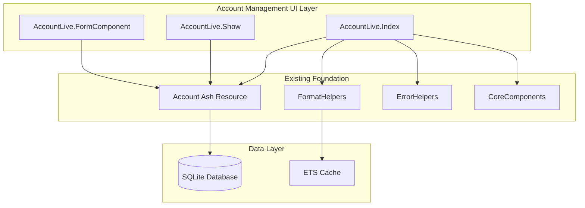

# Account Management Design Document

## Overview

This design document outlines the technical architecture for implementing comprehensive account management functionality in Ashfolio Phase 1. The system builds upon the existing Account Ash resource to provide a complete user interface for managing investment accounts with full CRUD operations, form validation, and seamless integration with the portfolio system.

### Core Design Principles

- Build upon the well-implemented Account Ash resource
- Follow established patterns from DashboardLive and existing components
- Use Phoenix LiveView forms with real-time validation
- Mobile-first design with desktop optimization
- WCAG AA compliance with proper ARIA labels and keyboard navigation
- Comprehensive error handling with user-friendly messages

## Architecture

### High-Level Component Architecture



### LiveView Module Structure

```
lib/ashfolio_web/live/account_live/
├── index.ex           # Account listing and management
├── show.ex            # Individual account detail view
└── form_component.ex  # Reusable form component for create/edit
```

## Components and Interfaces

### AccountLive.Index - Main Account Management

```elixir
defmodule AshfolioWeb.AccountLive.Index do
  use AshfolioWeb, :live_view

  alias Ashfolio.Portfolio.{Account, User}
  alias AshfolioWeb.AccountLive.FormComponent

  @impl true
  def mount(_params, _session, socket) do
    user_id = get_default_user_id()

    {:ok,
     socket
     |> assign_current_page(:accounts)
     |> assign(:page_title, "Investment Accounts")
     |> assign(:page_subtitle, "Manage your investment accounts and balances")
     |> assign(:user_id)
     |> assign(:accounts, list_accounts())
     |> assign(:show_form, false)
     |> assign(:form_action, :new)
     |> assign(:selected_account, nil)}
  end

  @impl true
  def handle_params(params, _url, socket) do
    {:noreply, apply_action(socket, socket.assigns.live_action, params)}
  end

  @impl true
  def handle_event("new_account", _params, socket) do
    {:noreply,
     socket
     |> assign(:show_form, true)
     |> assign(:form_action, :new)
     |> assign(:selected_account, nil)}
  end

  @impl true
  def handle_event("edit_account", %{"id" => id}, socket) do
    account = Enum.find(socket.assigns.accounts, &(&1.id == id))

    {:noreply,
     socket
     |> assign(:show_form, true)
     |> assign(:form_action, :edit)
     |> assign(:selected_account, account)}
  end

  @impl true
  def handle_event("delete_account", %{"id" => id}, socket) do
    case Account.destroy(id) do
      :ok ->
        {:noreply,
         socket
         |> put_flash(:info, "Account deleted successfully")
         |> assign(:accounts, list_accounts(socket.assigns.user_id))}

      {:error, reason} ->
        {:noreply, put_flash(socket, :error, "Failed to delete account: #{reason}")}
    end
  end

  @impl true
  def handle_event("toggle_exclusion", %{"id" => id}, socket) do
    account = Enum.find(socket.assigns.accounts, &(&1.id == id))

    case Account.toggle_exclusion(account, %{is_excluded: !account.is_excluded}) do
      {:ok, _updated_account} ->
        {:noreply,
         socket
         |> put_flash(:info, "Account exclusion updated")
         |> assign(:accounts, list_accounts(socket.assigns.user_id))}

      {:error, reason} ->
        {:noreply, put_flash(socket, :error, "Failed to update account: #{reason}")}
    end
  end

  @impl true
  def handle_info({FormComponent, {:saved, _account}}, socket) do
    {:noreply,
     socket
     |> put_flash(:info, "Account saved successfully")
     |> assign(:show_form, false)
     |> assign(:accounts, list_accounts(socket.assigns.user_id))}
  end

  @impl true
  def handle_info({FormComponent, :cancel}, socket) do
    {:noreply, assign(socket, :show_form, false)}
  end

  defp list_accounts() do
    Account.accounts_for_user!()
  end

  defp apply_action(socket, :index, _params) do
    socket
    |> assign(:show_form, false)
    |> assign(:selected_account, nil)
  end

  defp apply_action(socket, :new, _params) do
    socket
    |> assign(:show_form, true)
    |> assign(:form_action, :new)
    |> assign(:selected_account, nil)
  end

  defp apply_action(socket, :edit, %{"id" => id}) do
    account = Account.get_by_id!(id)

    socket
    |> assign(:show_form, true)
    |> assign(:form_action, :edit)
    |> assign(:selected_account, account)
  end
end
```

### AccountLive.Show - Account Detail View

```elixir
defmodule AshfolioWeb.AccountLive.Show do
  use AshfolioWeb, :live_view

  alias Ashfolio.Portfolio.{Account, Transaction}

  @impl true
  def mount(_params, _session, socket) do
    {:ok, socket}
  end

  @impl true
  def handle_params(%{"id" => id}, _uri, socket) do
    account = Account.get_by_id!(id)
    transactions = Transaction.by_account!(id)

    {:noreply,
     socket
     |> assign_current_page(:accounts)
     |> assign(:page_title, account.name)
     |> assign(:page_subtitle, "Account Details")
     |> assign(:account, account)
     |> assign(:transactions, transactions)
     |> assign(:transaction_count, length(transactions))
     |> assign(:total_transaction_value, calculate_total_value(transactions))}
  end

  @impl true
  def handle_event("delete_account", %{"id" => id}, socket) do
    case Account.destroy(id) do
      :ok ->
        {:noreply,
         socket
         |> put_flash(:info, "Account deleted successfully")
         |> push_navigate(to: ~p"/accounts")}

      {:error, reason} ->
        {:noreply, put_flash(socket, :error, "Failed to delete account: #{reason}")}
    end
  end

  defp calculate_total_value(transactions) do
    transactions
    |> Enum.reduce(Decimal.new(0), fn transaction, acc ->
      case transaction.type do
        :buy -> Decimal.add(acc, transaction.total_amount)
        :sell -> Decimal.sub(acc, transaction.total_amount)
        _ -> acc
      end
    end)
  end
end
```

### AccountLive.FormComponent - Reusable Form Component

```elixir
defmodule AshfolioWeb.AccountLive.FormComponent do
  use AshfolioWeb, :live_component

  alias Ashfolio.Portfolio.Account

  @impl true
  def render(assigns) do
    ~H"""
    <div class="fixed inset-0 bg-gray-500 bg-opacity-75 flex items-center justify-center p-4 z-50">
      <div class="bg-white rounded-lg shadow-xl max-w-md w-full p-6">
        <div class="flex justify-between items-center mb-4">
          <h3 class="text-lg font-medium text-gray-900">
            <%= if @action == :new, do: "New Account", else: "Edit Account" %>
          </h3>
          <button
            type="button"
            phx-click="cancel"
            phx-target={@myself}
            class="text-gray-400 hover:text-gray-600"
          >
            <span class="sr-only">Close</span>
            <svg class="h-6 w-6" fill="none" viewBox="0 0 24 24" stroke="currentColor">
              <path stroke-linecap="round" stroke-linejoin="round" stroke-width="2" d="M6 18L18 6M6 6l12 12" />
            </svg>
          </button>
        </div>

        <.simple_form
          for={@form}
          id="account-form"
          phx-target={@myself}
          phx-change="validate"
          phx-submit="save"
        >
          <.input field={@form[:name]} type="text" label="Account Name" required />
          <.input field={@form[:platform]} type="text" label="Platform" placeholder="e.g., Schwab, Fidelity" />
          <.input field={@form[:balance]} type="number" label="Current Balance" step="0.01" />
          <.input field={@form[:is_excluded]} type="checkbox" label="Exclude from portfolio calculations" />

          <:actions>
            <.button phx-disable-with="Saving..." class="w-full">
              <%= if @action == :new, do: "Create Account", else: "Update Account" %>
            </.button>
          </:actions>
        </.simple_form>
      </div>
    </div>
    """
  end

  @impl true
  def update(%{account: account} = assigns, socket) do
    {:ok,
     socket
     |> assign(assigns)
     |> assign_new(:form, fn ->
       to_form(Account.changeset_for_create(account))
     end)}
  end

  @impl true
  def handle_event("validate", %{"account" => account_params}, socket) do
    changeset = Account.changeset_for_create(socket.assigns.account, account_params)
    {:noreply, assign(socket, form: to_form(changeset, action: :validate))}
  end

  @impl true
  def handle_event("save", %{"account" => account_params}, socket) do
    save_account(socket, socket.assigns.action, account_params)
  end

  @impl true
  def handle_event("cancel", _params, socket) do
    notify_parent(:cancel)
    {:noreply, socket}
  end

  defp save_account(socket, :new, account_params) do
    account_params = Map.put(account_params, "user_id", socket.assigns.user_id)

    case Account.create(account_params) do
      {:ok, account} ->
        notify_parent({:saved, account})
        {:noreply, socket}

      {:error, %Ash.Changeset{} = changeset} ->
        {:noreply, assign(socket, form: to_form(changeset))}
    end
  end

  defp save_account(socket, :edit, account_params) do
    case Account.update(socket.assigns.account, account_params) do
      {:ok, account} ->
        notify_parent({:saved, account})
        {:noreply, socket}

      {:error, %Ash.Changeset{} = changeset} ->
        {:noreply, assign(socket, form: to_form(changeset))}
    end
  end

  defp notify_parent(msg), do: send(self(), {__MODULE__, msg})
end
```

## Data Models

### Account Resource Integration

The existing Account Ash resource provides all necessary functionality:

```elixir
# Available Actions:
Account.create(attrs)           # Create new account
Account.list!()                 # List all accounts
Account.get_by_id!(id)         # Get specific account
Account.accounts_for_user!(id) # Get accounts for user
Account.update(account, attrs)  # Update account
Account.toggle_exclusion(account, attrs) # Toggle exclusion
Account.destroy(id)            # Delete account (with transaction check)
```

### Account Balance Strategy (Phase 1)

For Phase 1 simplicity, account balances are manually maintained:

```elixir
# Manual balance management (Phase 1)
# - Users manually enter and update account balances
# - Balances are independent of transaction calculations
# - Future phases may add transaction-based balance calculation

# Balance validation
defp validate_balance(changeset) do
  changeset
  |> validate_number(:balance, greater_than_or_equal_to: 0)
  |> validate_decimal_precision(:balance, precision: 2)
end
```

### Account Deletion Strategy (Phase 1)

Safe deletion approach to prevent data loss:

```elixir
# Account deletion with transaction protection
def safe_delete_account(account_id) do
  case Transaction.by_account!(account_id) do
    [] ->
      # No transactions, safe to delete
      Account.destroy(account_id)

    _transactions ->
      # Has transactions, prevent deletion
      {:error, :has_transactions,
       "Account has associated transactions. Consider excluding the account instead."}
  end
end
```

### Form Data Structure

```elixir
# Account form parameters
%{
  "name" => "Schwab Brokerage",
  "platform" => "Schwab",
  "balance" => "10000.00",
  "is_excluded" => false,
  "user_id" => "uuid-string"
}
```

## User Interface Design

### Account List View Layout

```heex
<div class="space-y-6">
  <!-- Header with New Account Button -->
  <div class="flex justify-between items-center">
    <div>
      <h1 class="text-2xl font-bold text-gray-900">Investment Accounts</h1>
      <p class="text-gray-600">Manage your investment accounts and balances</p>
    </div>
    <.button phx-click="new_account" class="bg-blue-600 hover:bg-blue-700">
      <svg class="w-4 h-4 mr-2" fill="none" stroke="currentColor" viewBox="0 0 24 24">
        <path stroke-linecap="round" stroke-linejoin="round" stroke-width="2" d="M12 4v16m8-8H4" />
      </svg>
      New Account
    </.button>
  </div>

  <!-- Accounts Table -->
  <div class="bg-white shadow rounded-lg overflow-hidden">
    <.table id="accounts-table" rows={@accounts}>
      <:col :let={account} label="Account">
        <div class="flex items-center">
          <div>
            <div class="font-medium text-gray-900">{account.name}</div>
            <div class="text-sm text-gray-500">{account.platform}</div>
          </div>
          <%= if account.is_excluded do %>
            <span class="ml-2 inline-flex items-center px-2.5 py-0.5 rounded-full text-xs font-medium bg-gray-100 text-gray-800">
              Excluded
            </span>
          <% end %>
        </div>
      </:col>

      <:col :let={account} label="Balance" class="text-right">
        <span class="font-medium text-gray-900">
          {FormatHelpers.format_currency(account.balance)}
        </span>
      </:col>

      <:col :let={account} label="Actions" class="text-right">
        <div class="flex justify-end space-x-2">
          <.button
            size="sm"
            variant="outline"
            phx-click="edit_account"
            phx-value-id={account.id}
          >
            Edit
          </.button>

          <.button
            size="sm"
            variant="outline"
            phx-click="toggle_exclusion"
            phx-value-id={account.id}
          >
            <%= if account.is_excluded, do: "Include", else: "Exclude" %>
          </.button>

          <.button
            size="sm"
            variant="outline"
            class="text-red-600 hover:text-red-700"
            phx-click="delete_account"
            phx-value-id={account.id}
            data-confirm="Are you sure you want to delete this account?"
          >
            Delete
          </.button>
        </div>
      </:col>
    </.table>
  </div>

  <!-- Empty State -->
  <%= if Enum.empty?(@accounts) do %>
    <div class="text-center py-12">
      <svg class="mx-auto h-12 w-12 text-gray-400" fill="none" viewBox="0 0 24 24" stroke="currentColor">
        <path stroke-linecap="round" stroke-linejoin="round" stroke-width="2" d="M19 21V5a2 2 0 00-2-2H7a2 2 0 00-2 2v16m14 0h2m-2 0h-5m-9 0H3m2 0h5M9 7h1m-1 4h1m4-4h1m-1 4h1m-5 10v-5a1 1 0 011-1h2a1 1 0 011 1v5m-4 0h4" />
      </svg>
      <h3 class="mt-2 text-sm font-medium text-gray-900">No accounts</h3>
      <p class="mt-1 text-sm text-gray-500">Get started by creating your first investment account.</p>
      <div class="mt-6">
        <.button phx-click="new_account" class="bg-blue-600 hover:bg-blue-700">
          <svg class="w-4 h-4 mr-2" fill="none" stroke="currentColor" viewBox="0 0 24 24">
            <path stroke-linecap="round" stroke-linejoin="round" stroke-width="2" d="M12 4v16m8-8H4" />
          </svg>
          New Account
        </.button>
      </div>
    </div>
  <% end %>
</div>

<!-- Form Modal -->
<%= if @show_form do %>
  <.live_component
    module={FormComponent}
    id="account-form"
    action={@form_action}
    account={@selected_account || %Account{}}
    user_id={@user_id}
  />
<% end %>
```

### Account Detail View Layout

```heex
<div class="space-y-6">
  <!-- Header -->
  <div class="flex justify-between items-center">
    <div>
      <nav class="flex" aria-label="Breadcrumb">
        <ol class="flex items-center space-x-4">
          <li>
            <.link navigate={~p"/accounts"} class="text-gray-500 hover:text-gray-700">
              Accounts
            </.link>
          </li>
          <li class="flex items-center">
            <svg class="flex-shrink-0 h-5 w-5 text-gray-400" fill="currentColor" viewBox="0 0 20 20">
              <path fill-rule="evenodd" d="M7.293 14.707a1 1 0 010-1.414L10.586 10 7.293 6.707a1 1 0 011.414-1.414l4 4a1 1 0 010 1.414l-4 4a1 1 0 01-1.414 0z" clip-rule="evenodd" />
            </svg>
            <span class="ml-4 text-sm font-medium text-gray-900">{@account.name}</span>
          </li>
        </ol>
      </nav>
      <h1 class="mt-2 text-2xl font-bold text-gray-900">{@account.name}</h1>
      <p class="text-gray-600">{@account.platform}</p>
    </div>

    <div class="flex space-x-3">
      <.button variant="outline" navigate={~p"/accounts/#{@account.id}/edit"}>
        Edit Account
      </.button>
      <.button
        variant="outline"
        class="text-red-600 hover:text-red-700"
        phx-click="delete_account"
        phx-value-id={@account.id}
        data-confirm="Are you sure you want to delete this account? This action cannot be undone."
      >
        Delete Account
      </.button>
    </div>
  </div>

  <!-- Account Stats -->
  <div class="grid grid-cols-1 md:grid-cols-3 gap-6">
    <div class="bg-white overflow-hidden shadow rounded-lg">
      <div class="p-5">
        <div class="flex items-center">
          <div class="flex-shrink-0">
            <svg class="h-6 w-6 text-gray-400" fill="none" viewBox="0 0 24 24" stroke="currentColor">
              <path stroke-linecap="round" stroke-linejoin="round" stroke-width="2" d="M12 8c-1.657 0-3 .895-3 2s1.343 2 3 2 3 .895 3 2-1.343 2-3 2m0-8c1.11 0 2.08.402 2.599 1M12 8V7m0 1v8m0 0v1m0-1c-1.11 0-2.08-.402-2.599-1" />
            </svg>
          </div>
          <div class="ml-5 w-0 flex-1">
            <dl>
              <dt class="text-sm font-medium text-gray-500 truncate">Current Balance</dt>
              <dd class="text-lg font-medium text-gray-900">
                {FormatHelpers.format_currency(@account.balance)}
              </dd>
            </dl>
          </div>
        </div>
      </div>
    </div>

    <div class="bg-white overflow-hidden shadow rounded-lg">
      <div class="p-5">
        <div class="flex items-center">
          <div class="flex-shrink-0">
            <svg class="h-6 w-6 text-gray-400" fill="none" viewBox="0 0 24 24" stroke="currentColor">
              <path stroke-linecap="round" stroke-linejoin="round" stroke-width="2" d="M9 19v-6a2 2 0 00-2-2H5a2 2 0 00-2 2v6a2 2 0 002 2h2a2 2 0 002-2zm0 0V9a2 2 0 012-2h2a2 2 0 012 2v10m-6 0a2 2 0 002 2h2a2 2 0 002-2m0 0V5a2 2 0 012-2h2a2 2 0 012 2v14a2 2 0 01-2 2h-2a2 2 0 01-2-2z" />
            </svg>
          </div>
          <div class="ml-5 w-0 flex-1">
            <dl>
              <dt class="text-sm font-medium text-gray-500 truncate">Transactions</dt>
              <dd class="text-lg font-medium text-gray-900">{@transaction_count}</dd>
            </dl>
          </div>
        </div>
      </div>
    </div>

    <div class="bg-white overflow-hidden shadow rounded-lg">
      <div class="p-5">
        <div class="flex items-center">
          <div class="flex-shrink-0">
            <svg class="h-6 w-6 text-gray-400" fill="none" viewBox="0 0 24 24" stroke="currentColor">
              <path stroke-linecap="round" stroke-linejoin="round" stroke-width="2" d="M13 7h8m0 0v8m0-8l-8 8-4-4-6 6" />
            </svg>
          </div>
          <div class="ml-5 w-0 flex-1">
            <dl>
              <dt class="text-sm font-medium text-gray-500 truncate">Status</dt>
              <dd class="text-lg font-medium text-gray-900">
                <%= if @account.is_excluded do %>
                  <span class="inline-flex items-center px-2.5 py-0.5 rounded-full text-xs font-medium bg-gray-100 text-gray-800">
                    Excluded
                  </span>
                <% else %>
                  <span class="inline-flex items-center px-2.5 py-0.5 rounded-full text-xs font-medium bg-green-100 text-green-800">
                    Active
                  </span>
                <% end %>
              </dd>
            </dl>
          </div>
        </div>
      </div>
    </div>
  </div>

  <!-- Recent Transactions -->
  <div class="bg-white shadow rounded-lg">
    <div class="px-4 py-5 sm:p-6">
      <h3 class="text-lg leading-6 font-medium text-gray-900 mb-4">Recent Transactions</h3>
      <%= if Enum.empty?(@transactions) do %>
        <div class="text-center py-6">
          <p class="text-gray-500">No transactions found for this account.</p>
          <.link navigate={~p"/transactions/new?account_id=#{@account.id}"} class="text-blue-600 hover:text-blue-500">
            Add your first transaction
          </.link>
        </div>
      <% else %>
        <.table id="account-transactions" rows={Enum.take(@transactions, 10)}>
          <:col :let={transaction} label="Date">{transaction.date}</:col>
          <:col :let={transaction} label="Type">{String.upcase(to_string(transaction.type))}</:col>
          <:col :let={transaction} label="Symbol">{transaction.symbol.symbol}</:col>
          <:col :let={transaction} label="Quantity">{FormatHelpers.format_quantity(transaction.quantity)}</:col>
          <:col :let={transaction} label="Amount" class="text-right">
            {FormatHelpers.format_currency(transaction.total_amount)}
          </:col>
        </.table>

        <%= if length(@transactions) > 10 do %>
          <div class="mt-4 text-center">
            <.link navigate={~p"/transactions?account_id=#{@account.id}"} class="text-blue-600 hover:text-blue-500">
              View all {length(@transactions)} transactions
            </.link>
          </div>
        <% end %>
      <% end %>
    </div>
  </div>
</div>
```

## Error Handling

### Form Validation Strategy

```elixir
defmodule AshfolioWeb.AccountLive.FormValidation do
  def validate_account_form(changeset) do
    changeset
    |> validate_required_fields()
    |> validate_balance_format()
    |> validate_name_uniqueness()
    |> format_validation_errors()
  end

  defp validate_required_fields(changeset) do
    # Leverage Ash validations with custom error messages
    changeset
  end

  defp validate_balance_format(changeset) do
    # Ensure balance is valid decimal with proper precision
    changeset
  end

  defp format_validation_errors(changeset) do
    # Convert Ash errors to user-friendly messages
    changeset
  end
end
```

### Error Recovery Patterns

1.  Retry with exponential backoff
2.  Highlight fields with specific messages
3.  Graceful degradation with user-friendly messages
4.  Optimistic locking with conflict resolution

## Testing Strategy

### Unit Tests

```elixir
defmodule AshfolioWeb.AccountLive.IndexTest do
  use AshfolioWeb.LiveViewCase

  describe "account listing" do
    test "displays all accounts", %{conn: conn} do
      # Test account list display
    end

    test "shows empty state when no accounts", %{conn: conn} do
      # Test empty state
    end
  end

  describe "account creation" do
    test "creates account with valid data", %{conn: conn} do
      # Test successful creation
    end

    test "shows validation errors for invalid data", %{conn: conn} do
      # Test validation handling
    end
  end

  describe "account management" do
    test "edits existing account", %{conn: conn} do
      # Test edit functionality
    end

    test "deletes account with confirmation", %{conn: conn} do
      # Test deletion
    end

    test "toggles account exclusion", %{conn: conn} do
      # Test exclusion toggle
    end
  end
end
```

### Integration Tests

```elixir
defmodule AshfolioWeb.AccountManagementIntegrationTest do
  use AshfolioWeb.LiveViewCase

  test "complete account management workflow", %{conn: conn} do
    # Test: Create account → Edit account → View details → Delete account
  end

  test "account exclusion affects portfolio calculations", %{conn: conn} do
    # Test integration with portfolio system
  end

  test "account deletion with transactions is prevented", %{conn: conn} do
    # Test safe deletion behavior
  end

  test "portfolio calculations update when account exclusion changes", %{conn: conn} do
    # Test real-time portfolio integration
  end

  test "account balance updates reflect in portfolio summaries", %{conn: conn} do
    # Test balance change propagation
  end

  test "account list performance with multiple accounts", %{conn: conn} do
    # Test performance with up to 50 accounts (Phase 1 target)
  end
end
```

## Performance Considerations

### Optimization Strategies

1.  Load transaction details only when needed
2.  Cache account lists with ETS for frequent access
3.  Implement pagination for large account lists
4.  Debounce form validation to reduce server load

### Memory Management

```elixir
# Efficient account loading with preloading
def list_accounts_with_stats() do
  Account.accounts_for_user!()
  |> Ash.load([:transaction_count, :total_balance])
end
```

## Accessibility Features

### WCAG AA Compliance

1.  All actions accessible via keyboard
2.  Proper ARIA labels and semantic markup
3.  Minimum 4.5:1 contrast ratio for all text
4.  Clear focus indicators and logical tab order
5.  Screen reader announcements for validation errors

### Responsive Design

```css
/* Mobile-first responsive design */
.account-table {
  @apply overflow-x-auto;
}

@media (max-width: 640px) {
  .account-actions {
    @apply flex-col space-y-2;
  }
}

@media (min-width: 768px) {
  .account-grid {
    @apply grid-cols-2;
  }
}

@media (min-width: 1024px) {
  .account-grid {
    @apply grid-cols-3;
  }
}
```

## Integration Points

### Portfolio System Integration

```elixir
# Account changes trigger portfolio recalculation
defmodule AshfolioWeb.AccountLive.PortfolioIntegration do
  def handle_account_change(account_id, change_type) do
    case change_type do
      :exclusion_toggled ->
        # Trigger portfolio recalculation
        Phoenix.PubSub.broadcast(
          Ashfolio.PubSub,
          "portfolio_updates",
          {:account_exclusion_changed, account_id}
        )

      :balance_updated ->
        # Update portfolio balance calculations
        Phoenix.PubSub.broadcast(
          Ashfolio.PubSub,
          "portfolio_updates",
          {:account_balance_changed, account_id}
        )

      :deleted ->
        # Handle account deletion impact
        Phoenix.PubSub.broadcast(
          Ashfolio.PubSub,
          "portfolio_updates",
          {:account_deleted, account_id}
        )
    end
  end
end
```

### Navigation Integration

```elixir
# Update router.ex for new routes
scope "/", AshfolioWeb do
  pipe_through :browser

  live "/", DashboardLive, :index
  live "/accounts", AccountLive.Index, :index
  live "/accounts/new", AccountLive.Index, :new
  live "/accounts/:id/edit", AccountLive.Index, :edit
  live "/accounts/:id", AccountLive.Show, :show
  live "/transactions", TransactionLive.Index, :index
end
```

## Completion Criteria

### Definition of Done

- All 10 requirements implemented with acceptance criteria met
- Comprehensive form validation with user-friendly error messages
- Responsive design working on desktop, tablet, and mobile
- WCAG AA accessibility compliance verified
- Integration with existing portfolio system confirmed
- Unit and integration tests passing with >90% coverage
- Error handling covers all failure scenarios
- Performance benchmarks met (page load <500ms, form submission <200ms)

### Success Metrics

1.  All CRUD operations working correctly
2.  Users can complete account management tasks without confusion
3.  Fast response times and smooth interactions
4.  Error-free operation under normal usage patterns
5.  Usable by users with assistive technologies
