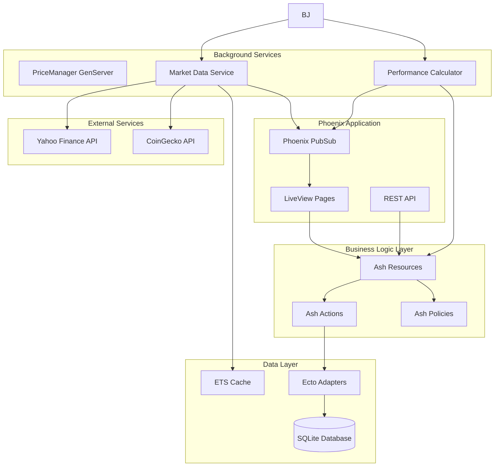

# Ashfolio Design Document - Simplified Phase 1

## Overview

This design document outlines the technical architecture for Ashfolio Phase 1, a simplified single-user local portfolio management application. The system focuses on core portfolio tracking functionality with minimal complexity and high development confidence.

### Core Design Principles

- **Simplicity First**: Minimal complexity to ensure high development success rate
- **Local-First**: Zero-configuration deployment with file-based SQLite database
- **No Authentication**: No registration or login process required - direct access to portfolio
- **Manual Updates**: User-initiated price updates instead of real-time automation
- **Domain-Driven**: Ash Framework for data modeling and business logic
- **Basic Performance**: Simple ETS caching without complex optimization
- **Standard Configuration**: Phoenix defaults without platform-specific tuning

## Architecture

### High-Level Architecture



### Technology Stack

- **Runtime**: Elixir/OTP with BEAM VM (standard configuration)
- **Web Framework**: Phoenix 1.7+ with LiveView
- **Data Framework**: Ash Framework 3.0+
- **Database**: SQLite with Ecto adapter
- **Cache**: Simple ETS for price caching
- **Background Processing**: Basic GenServer for price updates
- **HTTP Client**: HTTPoison for Yahoo Finance API calls
- **Platform**: Cross-platform (macOS, Linux, Windows)

## Components and Interfaces

### Core Ash Resources

#### User Resource

```elixir
# Single default user for local application - no registration/login required
# User is automatically created on first application startup
defmodule Ashfolio.Portfolio.User do
  use Ash.Resource, data_layer: AshSqlite.DataLayer

  attributes do
    uuid_primary_key :id
    attribute :name, :string, default: "Local User"
    attribute :currency, :string, default: "USD"
    attribute :locale, :string, default: "en-US"
    timestamps()
  end

  relationships do
    has_many :accounts, Ashfolio.Portfolio.Account
    has_many :transactions, Ashfolio.Portfolio.Transaction
  end

  actions do
    defaults [:read, :update] # No create/destroy - single user exists by default

    read :default_user do
      # Always returns the single local user
    end
  end
end
```

#### Account Resource

```elixir
defmodule Ashfolio.Portfolio.Account do
  use Ash.Resource, data_layer: AshSqlite.DataLayer

  attributes do
    uuid_primary_key :id
    attribute :name, :string, allow_nil?: false
    attribute :platform, :string
    attribute :currency, :string, default: "USD"
    attribute :is_excluded, :boolean, default: false
    attribute :balance, :decimal, default: Decimal.new(0)
    timestamps()
  end

  relationships do
    belongs_to :user, Ashfolio.Portfolio.User
    has_many :transactions, Ashfolio.Portfolio.Transaction
  end

  actions do
    defaults [:create, :read, :update, :destroy]

    read :active do
      filter expr(is_excluded == false)
    end
  end
end
```

#### Symbol Resource

```elixir
defmodule Ashfolio.Portfolio.Symbol do
  use Ash.Resource, data_layer: AshSqlite.DataLayer

  attributes do
    uuid_primary_key :id
    attribute :symbol, :string, allow_nil?: false
    attribute :name, :string
    attribute :asset_class, :atom, constraints: [one_of: [:stock, :etf, :crypto, :bond, :commodity]]
    attribute :currency, :string, default: "USD"
    attribute :isin, :string
    attribute :sectors, {:array, :string}, default: []
    attribute :countries, {:array, :string}, default: []
    attribute :data_source, :atom, constraints: [one_of: [:yahoo_finance, :coingecko, :manual]]
    attribute :current_price, :decimal
    attribute :price_updated_at, :utc_datetime
    timestamps()
  end

  relationships do
    has_many :transactions, Ashfolio.Portfolio.Transaction
    has_many :price_histories, Ashfolio.Portfolio.PriceHistory
  end

  actions do
    defaults [:create, :read, :update, :destroy]

    update :update_price do
      accept [:current_price, :price_updated_at]
    end
  end
end
```

#### Transaction Resource

```elixir
defmodule Ashfolio.Portfolio.Transaction do
  use Ash.Resource, data_layer: AshSqlite.DataLayer

  attributes do
    uuid_primary_key :id
    attribute :type, :atom, constraints: [one_of: [:buy, :sell, :dividend, :fee, :interest, :liability]]
    attribute :quantity, :decimal, allow_nil?: false
    attribute :unit_price, :decimal, allow_nil?: false
    attribute :fee, :decimal, default: Decimal.new(0)
    attribute :date, :date, allow_nil?: false
    attribute :currency, :string, default: "USD"
    attribute :comment, :string
    attribute :is_draft, :boolean, default: false
    timestamps()
  end

  relationships do
    belongs_to :user, Ashfolio.Portfolio.User
    belongs_to :account, Ashfolio.Portfolio.Account
    belongs_to :symbol, Ashfolio.Portfolio.Symbol
  end

  calculations do
    calculate :total_value, :decimal, expr(quantity * unit_price + fee)
  end

  actions do
    defaults [:create, :read, :update, :destroy]

    read :by_account do
      argument :account_id, :uuid, allow_nil?: false
      filter expr(account_id == ^arg(:account_id))
    end

    read :completed do
      filter expr(is_draft == false)
    end
  end
end
```

### Market Data Services

#### Simple Market Data Services

```elixir
defmodule Ashfolio.MarketData.YahooFinance do
  # Simple Yahoo Finance API integration
  # - Direct HTTP calls with HTTPoison
  # - Basic error handling with logging
  # - Price caching in ETS

  def fetch_price(symbol) do
    case HTTPoison.get(build_url(symbol)) do
      {:ok, %{status_code: 200, body: body}} ->
        parse_price(body)
      {:error, reason} ->
        Logger.error("Failed to fetch price for #{symbol}: #{inspect(reason)}")
        {:error, reason}
    end
  end

  defp parse_price(body) do
    # Simple JSON parsing to extract current price
    # Return {:ok, price} or {:error, :parse_error}
  end
end
```

#### Simple Price Manager

```elixir
defmodule Ashfolio.MarketData.PriceManager do
  use GenServer

  # Simple price management
  # - Manual price refresh on user request
  # - Basic ETS caching
  # - Simple error logging

  def refresh_prices(symbols) do
    GenServer.call(__MODULE__, {:refresh_prices, symbols})
  end

  def handle_call({:refresh_prices, symbols}, _from, state) do
    results = Enum.map(symbols, &fetch_and_cache_price/1)
    {:reply, results, state}
  end

  defp fetch_and_cache_price(symbol) do
    case YahooFinance.fetch_price(symbol) do
      {:ok, price} ->
        :ets.insert(:price_cache, {symbol, price, DateTime.utc_now()})
        {:ok, price}
      error ->
        error
    end
  end
end
```

### Portfolio Calculation Engine

#### Dual Calculator Architecture

The portfolio calculation system uses a dual calculator architecture for different use cases:

- **`Ashfolio.Portfolio.Calculator`**: Main portfolio calculations for general use
- **`Ashfolio.Portfolio.HoldingsCalculator`**: Specialized holdings analysis with detailed cost basis tracking

#### Main Portfolio Calculator

```elixir
defmodule Ashfolio.Portfolio.Calculator do
  @moduledoc """
  Simple portfolio calculations for Ashfolio Phase 1.

  Provides basic portfolio value calculations, return percentages, and individual
  position gains/losses using simple formulas suitable for Phase 1 scope.
  """

  def calculate_portfolio_value(user_id) do
    # Calculate total portfolio value as sum of all holdings
    case get_all_holdings(user_id) do
      {:ok, holdings} ->
        total_value =
          holdings
          |> Enum.map(&calculate_holding_value/1)
          |> Enum.reduce(Decimal.new(0), &Decimal.add/2)
        {:ok, total_value}
      {:error, reason} -> {:error, reason}
    end
  end

  def calculate_simple_return(current_value, cost_basis) do
    # Simple return formula: (current_value - cost_basis) / cost_basis * 100
    cond do
      Decimal.equal?(cost_basis, 0) -> {:ok, Decimal.new(0)}
      true ->
        difference = Decimal.sub(current_value, cost_basis)
        percentage =
          difference
          |> Decimal.div(cost_basis)
          |> Decimal.mult(100)
        {:ok, percentage}
    end
  end

  def calculate_position_returns(user_id) do
    # Calculate individual position gains/losses for all holdings
    case get_all_holdings(user_id) do
      {:ok, holdings} ->
        positions =
          holdings
          |> Enum.map(&calculate_position_data/1)
          |> Enum.filter(fn position -> position.quantity != Decimal.new(0) end)
        {:ok, positions}
      {:error, reason} -> {:error, reason}
    end
  end

  def calculate_total_return(user_id) do
    # Get total return tracking data for the portfolio
    with {:ok, portfolio_value} <- calculate_portfolio_value(user_id),
         {:ok, total_cost_basis} <- calculate_total_cost_basis(user_id),
         {:ok, return_percentage} <- calculate_simple_return(portfolio_value, total_cost_basis) do

      summary = %{
        total_value: portfolio_value,
        cost_basis: total_cost_basis,
        return_percentage: return_percentage,
        dollar_return: Decimal.sub(portfolio_value, total_cost_basis)
      }
      {:ok, summary}
    end
  end
end
```

#### Holdings Value Calculator

```elixir
defmodule Ashfolio.Portfolio.HoldingsCalculator do
  @moduledoc """
  Holdings value calculator for Ashfolio Phase 1.

  Provides focused calculations for individual holdings values, cost basis,
  and profit/loss calculations with FIFO cost basis method.
  """

  def calculate_holding_values(user_id) do
    # Calculate current holding values for all positions
    with {:ok, holdings_data} <- get_holdings_data(user_id) do
      holdings_with_values =
        holdings_data
        |> Enum.map(&calculate_individual_holding_value/1)
        |> Enum.filter(fn holding -> not Decimal.equal?(holding.quantity, 0) end)
      {:ok, holdings_with_values}
    end
  end

  def calculate_cost_basis(user_id, symbol_id) do
    # Calculate cost basis from transaction history using FIFO method
    case get_symbol_transactions(user_id, symbol_id) do
      {:ok, transactions} ->
        cost_basis_data = calculate_cost_basis_from_transactions(transactions)
        {:ok, cost_basis_data}
      {:error, reason} -> {:error, reason}
    end
  end

  def calculate_holding_pnl(user_id, symbol_id) do
    # Calculate profit/loss for individual holdings
    with {:ok, cost_basis_data} <- calculate_cost_basis(user_id, symbol_id),
         {:ok, symbol} <- Symbol.get_by_id(symbol_id) do

      current_price = get_current_price(symbol)
      current_value = if current_price do
        Decimal.mult(cost_basis_data.quantity, current_price)
      else
        Decimal.new(0)
      end

      unrealized_pnl = Decimal.sub(current_value, cost_basis_data.total_cost)
      unrealized_pnl_pct = calculate_percentage_return(unrealized_pnl, cost_basis_data.total_cost)

      pnl_data = %{
        symbol: symbol.symbol,
        quantity: cost_basis_data.quantity,
        current_price: current_price,
        current_value: current_value,
        cost_basis: cost_basis_data.total_cost,
        average_cost: cost_basis_data.average_cost,
        unrealized_pnl: unrealized_pnl,
        unrealized_pnl_pct: unrealized_pnl_pct
      }
      {:ok, pnl_data}
    end
  end

  def get_holdings_summary(user_id) do
    # Get comprehensive holdings summary with all calculations
    with {:ok, holdings} <- calculate_holding_values(user_id),
         {:ok, total_value} <- aggregate_portfolio_value(user_id) do

      total_cost_basis =
        holdings
        |> Enum.map(& &1.cost_basis)
        |> Enum.reduce(Decimal.new(0), &Decimal.add/2)

      total_pnl = Decimal.sub(total_value, total_cost_basis)
      total_pnl_pct = calculate_percentage_return(total_pnl, total_cost_basis)

      summary = %{
        holdings: holdings,
        total_value: total_value,
        total_cost_basis: total_cost_basis,
        total_pnl: total_pnl,
        total_pnl_pct: total_pnl_pct,
        holdings_count: length(holdings)
      }
      {:ok, summary}
    end
  end

  # FIFO cost basis calculation from transactions
  defp calculate_cost_basis_from_transactions(transactions) do
    {total_quantity, total_cost, _} =
      Enum.reduce(transactions, {Decimal.new(0), Decimal.new(0), []}, fn transaction, {qty, cost, lots} ->
        case transaction.type do
          :buy ->
            new_qty = Decimal.add(qty, transaction.quantity)
            new_cost = Decimal.add(cost, transaction.total_amount)
            new_lot = %{quantity: transaction.quantity, cost: transaction.total_amount, date: transaction.date}
            {new_qty, new_cost, [new_lot | lots]}

          :sell ->
            # Reduce cost proportionally for simplified FIFO
            sell_qty = Decimal.abs(transaction.quantity)
            if Decimal.equal?(qty, 0) do
              {qty, cost, lots}
            else
              sell_ratio = Decimal.div(sell_qty, qty)
              cost_reduction = Decimal.mult(cost, sell_ratio)
              new_qty = Decimal.sub(qty, sell_qty)
              new_cost = Decimal.sub(cost, cost_reduction)
              {new_qty, new_cost, lots}
            end
        end
      end)

    average_cost = if Decimal.equal?(total_quantity, 0) do
      Decimal.new(0)
    else
      Decimal.div(total_cost, total_quantity)
    end

    %{
      quantity: total_quantity,
      total_cost: total_cost,
      average_cost: average_cost
    }
  end
end
```

#### Key Features

- **Financial Precision**: All calculations use Decimal types for accurate financial mathematics
- **FIFO Cost Basis**: Simplified First In, First Out method for cost basis calculations
- **Multi-Account Support**: Calculations work across multiple accounts with exclusion filtering
- **Error Handling**: Comprehensive error handling with logging and graceful degradation
- **Price Integration**: Uses both database prices and ETS cache fallback
- **Real-time Updates**: Calculations reflect current market prices when available

### LiveView Components

#### Portfolio Dashboard

```elixir
defmodule AshfolioWeb.DashboardLive do
  use AshfolioWeb, :live_view

  @impl true
  def mount(_params, _session, socket) do
    # Load portfolio data using Calculator modules
    user_id = get_default_user_id()

    with {:ok, total_return} <- Portfolio.Calculator.calculate_total_return(user_id),
         {:ok, holdings} <- Portfolio.HoldingsCalculator.calculate_holding_values(user_id) do

      socket =
        socket
        |> assign_current_page(:dashboard)
        |> assign(:page_title, "Dashboard")
        |> assign(:loading, false)
        |> assign(:portfolio_value, format_currency(total_return.total_value))
        |> assign(:total_return, format_currency(total_return.dollar_return))
        |> assign(:total_return_percent, format_percentage(total_return.return_percentage))
        |> assign(:holdings, holdings)
        |> assign(:holdings_count, length(holdings))
        |> assign(:sort_by, :symbol)
        |> assign(:sort_order, :asc)
        |> assign(:last_updated, get_last_price_update())

      {:ok, socket}
    else
      {:error, reason} ->
        Logger.error("Failed to load dashboard data: #{inspect(reason)}")
        {:ok, assign_error_state(socket)}
    end
  end

  @impl true
  def handle_event("refresh_prices", _params, socket) do
    socket = assign(socket, :loading, true)

    # Get symbols from current holdings
    symbols = Enum.map(socket.assigns.holdings, & &1.symbol)

    case PriceManager.refresh_prices(symbols) do
      {:ok, _results} ->
        # Reload portfolio data with updated prices
        socket = reload_portfolio_data(socket)
        socket =
          socket
          |> assign(:loading, false)
          |> put_flash(:info, "Prices updated successfully")
        {:noreply, socket}

      {:error, reason} ->
        socket =
          socket
          |> assign(:loading, false)
          |> put_flash(:error, "Failed to update prices: #{reason}")
        {:noreply, socket}
    end
  end

  @impl true
  def handle_event("sort", %{"column" => column}, socket) do
    {sort_by, sort_order} = toggle_sort(socket.assigns.sort_by, socket.assigns.sort_order, column)
    holdings = sort_holdings(socket.assigns.holdings, sort_by, sort_order)

    socket =
      socket
      |> assign(:sort_by, sort_by)
      |> assign(:sort_order, sort_order)
      |> assign(:holdings, holdings)

    {:noreply, socket}
  end

  # Holdings table with sorting
  defp render_holdings_table(assigns) do
    ~H"""
    <.table id="holdings-table" rows={@holdings} row_click={&JS.navigate(~p"/holdings/#{&1.symbol_id}")}>
      <:col :let={holding} label="Symbol">
        <div class="font-semibold text-gray-900">{holding.symbol}</div>
        <div class="text-sm text-gray-500">{holding.name}</div>
      </:col>
      <:col :let={holding} label="Quantity" class="text-right">
        {format_quantity(holding.quantity)}
      </:col>
      <:col :let={holding} label="Current Price" class="text-right">
        {format_currency(holding.current_price)}
      </:col>
      <:col :let={holding} label="Current Value" class="text-right">
        {format_currency(holding.current_value)}
      </:col>
      <:col :let={holding} label="Cost Basis" class="text-right">
        {format_currency(holding.cost_basis)}
      </:col>
      <:col :let={holding} label="P&L" class="text-right">
        <div class={pnl_color_class(holding.unrealized_pnl)}>
          <div>{format_currency(holding.unrealized_pnl)}</div>
          <div class="text-sm">({format_percentage(holding.unrealized_pnl_pct)})</div>
        </div>
      </:col>
    </.table>
    """
  end

  # Helper functions for formatting and sorting
  defp format_currency(decimal_value) do
    # Format Decimal as $X,XXX.XX
    decimal_value
    |> Decimal.round(2)
    |> Decimal.to_string()
    |> String.to_float()
    |> :erlang.float_to_binary(decimals: 2)
    |> then(&"$#{&1}")
  end

  defp format_percentage(decimal_value) do
    # Format Decimal as XX.XX%
    decimal_value
    |> Decimal.round(2)
    |> Decimal.to_string()
    |> then(&"#{&1}%")
  end

  defp pnl_color_class(pnl) do
    cond do
      Decimal.positive?(pnl) -> "text-green-600"
      Decimal.negative?(pnl) -> "text-red-600"
      true -> "text-gray-600"
    end
  end

  defp sort_holdings(holdings, sort_by, sort_order) do
    holdings
    |> Enum.sort_by(&Map.get(&1, sort_by), sort_order)
  end

  defp toggle_sort(current_sort, current_order, new_column) do
    new_column_atom = String.to_existing_atom(new_column)

    if current_sort == new_column_atom do
      {new_column_atom, toggle_order(current_order)}
    else
      {new_column_atom, :asc}
    end
  end

  defp toggle_order(:asc), do: :desc
  defp toggle_order(:desc), do: :asc
end
```

#### Holdings Table Implementation

Based on research findings, the holdings table will use the following technical approach:

**Data Source Integration:**

```elixir
# In DashboardLive mount/3
{:ok, holdings} = HoldingsCalculator.calculate_holding_values(user_id)

# Holdings data structure:
%{
  symbol_id: "uuid",
  symbol: "AAPL",
  name: "Apple Inc.",
  quantity: %Decimal{},
  current_price: %Decimal{},
  current_value: %Decimal{},
  cost_basis: %Decimal{},
  average_cost: %Decimal{},
  unrealized_pnl: %Decimal{},
  unrealized_pnl_pct: %Decimal{}
}
```

**Table Component Usage:**

```elixir
# Use existing Phoenix table component from core_components.ex
<.table id="holdings-table" rows={@holdings}>
  <:col :let={holding} label="Symbol">
    <div class="font-semibold">{holding.symbol}</div>
    <div class="text-sm text-gray-500">{holding.name}</div>
  </:col>
  <:col :let={holding} label="Quantity" class="text-right">
    {format_quantity(holding.quantity)}
  </:col>
  <:col :let={holding} label="Current Price" class="text-right">
    {format_currency(holding.current_price)}
  </:col>
  <:col :let={holding} label="Current Value" class="text-right">
    {format_currency(holding.current_value)}
  </:col>
  <:col :let={holding} label="P&L" class="text-right">
    <div class={pnl_color_class(holding.unrealized_pnl)}>
      <div>{format_currency(holding.unrealized_pnl)}</div>
      <div class="text-sm">({format_percentage(holding.unrealized_pnl_pct)})</div>
    </div>
  </:col>
</.table>
```

**Sorting Implementation:**

```elixir
# LiveView state management
assign(:sort_by, :symbol)
assign(:sort_order, :asc)

# Handle sort events
def handle_event("sort", %{"column" => column}, socket) do
  {sort_by, sort_order} = toggle_sort(socket.assigns.sort_by, socket.assigns.sort_order, column)
  holdings = sort_holdings(socket.assigns.holdings, sort_by, sort_order)

  socket =
    socket
    |> assign(:sort_by, sort_by)
    |> assign(:sort_order, sort_order)
    |> assign(:holdings, holdings)

  {:noreply, socket}
end
```

**Formatting Helpers:**

```elixir
defp format_currency(decimal_value) do
  decimal_value
  |> Decimal.round(2)
  |> Decimal.to_string()
  |> then(&"$#{&1}")
end

defp pnl_color_class(pnl) do
  cond do
    Decimal.positive?(pnl) -> "text-green-600"
    Decimal.negative?(pnl) -> "text-red-600"
    true -> "text-gray-600"
  end
end
```

#### Account Management

```elixir
defmodule AshfolioWeb.AccountLive.Index do
  use AshfolioWeb, :live_view

  # Account CRUD operations
  # - List all accounts
  # - Create/edit accounts
  # - Account balance tracking
end
```

## Data Models

### Database Schema Design

The SQLite database will use the following key tables:

```sql
-- Core entities
CREATE TABLE users (
  id TEXT PRIMARY KEY,
  name TEXT NOT NULL DEFAULT 'Local User',
  currency TEXT NOT NULL DEFAULT 'USD',
  locale TEXT NOT NULL DEFAULT 'en-US',
  inserted_at DATETIME NOT NULL,
  updated_at DATETIME NOT NULL
);

CREATE TABLE accounts (
  id TEXT PRIMARY KEY,
  user_id TEXT NOT NULL REFERENCES users(id),
  name TEXT NOT NULL,
  platform TEXT,
  currency TEXT NOT NULL DEFAULT 'USD',
  is_excluded BOOLEAN NOT NULL DEFAULT FALSE,
  balance DECIMAL(15,2) NOT NULL DEFAULT 0,
  inserted_at DATETIME NOT NULL,
  updated_at DATETIME NOT NULL
);

CREATE TABLE symbols (
  id TEXT PRIMARY KEY,
  symbol TEXT NOT NULL UNIQUE,
  name TEXT,
  asset_class TEXT NOT NULL,
  currency TEXT NOT NULL DEFAULT 'USD',
  isin TEXT,
  sectors TEXT, -- JSON array
  countries TEXT, -- JSON array
  data_source TEXT NOT NULL,
  current_price DECIMAL(15,4),
  price_updated_at DATETIME,
  inserted_at DATETIME NOT NULL,
  updated_at DATETIME NOT NULL
);

CREATE TABLE transactions (
  id TEXT PRIMARY KEY,
  user_id TEXT NOT NULL REFERENCES users(id),
  account_id TEXT NOT NULL REFERENCES accounts(id),
  symbol_id TEXT NOT NULL REFERENCES symbols(id),
  type TEXT NOT NULL,
  quantity DECIMAL(15,6) NOT NULL,
  unit_price DECIMAL(15,4) NOT NULL,
  fee DECIMAL(15,2) NOT NULL DEFAULT 0,
  date DATE NOT NULL,
  currency TEXT NOT NULL DEFAULT 'USD',
  comment TEXT,
  is_draft BOOLEAN NOT NULL DEFAULT FALSE,
  inserted_at DATETIME NOT NULL,
  updated_at DATETIME NOT NULL
);

-- Indexes for performance
CREATE INDEX idx_transactions_account_id ON transactions(account_id);
CREATE INDEX idx_transactions_symbol_id ON transactions(symbol_id);
CREATE INDEX idx_transactions_date ON transactions(date);
CREATE INDEX idx_transactions_type ON transactions(type);
CREATE INDEX idx_symbols_symbol ON symbols(symbol);
```

### ETS Cache Structure (macOS Optimized)

```elixir
# Market data cache - optimized for Apple Silicon and 16GB memory
:ets.new(:market_prices, [
  :set,
  :public,
  :named_table,
  {:write_concurrency, true},  # Leverage M1 Pro's multiple cores
  {:read_concurrency, true},
  {:decentralized_counters, true}  # Better performance on Apple Silicon
])
# Structure: {symbol, %{price: decimal, updated_at: datetime}}

# Portfolio performance cache with memory limits
:ets.new(:portfolio_performance, [
  :set,
  :public,
  :named_table,
  {:write_concurrency, true},
  {:read_concurrency, true}
])
# Structure: {user_id, %{period => performance_data}}

# Memory monitoring for 16GB systems
defmodule CacheMonitor do
  use GenServer

  def init(_) do
    # Monitor memory usage every 30 seconds
    :timer.send_interval(30_000, :check_memory)
    {:ok, %{}}
  end

  def handle_info(:check_memory, state) do
    memory_usage = :erlang.memory(:total)
    max_memory = 16 * 1024 * 1024 * 1024  # 16GB in bytes

    if memory_usage > max_memory * 0.8 do  # 80% threshold
      cleanup_old_cache_entries()
    end

    {:noreply, state}
  end
end
```

## Error Handling and System Resilience

### Centralized Error Handler

```elixir
defmodule Ashfolio.ErrorHandler do
  require Logger

  @moduledoc """
  Centralized error handling for the application.
  Provides consistent error logging, user-friendly messages, and recovery strategies.
  """

  # Error categories with specific handling
  @error_types %{
    network: %{severity: :warning, user_message: "Network connection issue. Please try again."},
    api_rate_limit: %{severity: :info, user_message: "Market data temporarily unavailable. Using cached prices."},
    validation: %{severity: :error, user_message: "Please check your input and try again."},
    system: %{severity: :critical, user_message: "System error occurred. Please contact support."}
  }

  def handle_error(error, context \\ %{}) do
    error_type = categorize_error(error)
    log_error(error, error_type, context)
    format_user_message(error_type, error)
  end

  defp categorize_error({:error, :network_timeout}), do: :network
  defp categorize_error({:error, :rate_limited}), do: :api_rate_limit
  defp categorize_error(%Ecto.Changeset{}), do: :validation
  defp categorize_error(_), do: :system

  defp log_error(error, type, context) do
    severity = @error_types[type][:severity]
    Logger.log(severity, "Error occurred", error: error, type: type, context: context)
  end
end
```

### API Resilience Strategy

1. **Circuit Breaker Pattern**:

   - 5 consecutive failures = open circuit
   - 30-second recovery timeout before attempting half_open
   - 2 consecutive successes = close circuit
   - Per-data-source circuit breaker state management

2. **Graceful Degradation**:

   - Fall back to cached prices when APIs fail
   - Allow manual price entry when all sources unavailable
   - Prioritize data sources: Yahoo Finance → CoinGecko → Manual
   - Display staleness indicators for cached data

3. **Retry Logic**:

   - Exponential backoff: 1s, 2s, 4s, 8s intervals
   - Maximum 3 retry attempts per request
   - Different strategies for different error types (network vs rate limit)
   - Structured logging for all retry attempts

4. **Cache Fallback**:
   - Use last known prices with staleness indicators
   - ETS cache with configurable TTL (default: 1 hour)
   - Background refresh jobs continue attempting updates
   - Memory-aware cache cleanup for 16GB systems

### Enhanced Data Validation

```elixir
defmodule Ashfolio.Validation do
  # Enhanced validation with recovery suggestions

  def validate_transaction(attrs) do
    attrs
    |> validate_required_fields()
    |> validate_financial_precision()
    |> validate_date_reasonableness()
    |> validate_symbol_exists()
    |> provide_recovery_suggestions()
  end

  defp provide_recovery_suggestions(%Ecto.Changeset{valid?: false} = changeset) do
    suggestions = generate_suggestions(changeset.errors)
    put_change(changeset, :recovery_suggestions, suggestions)
  end
end
```

1. **Ash Validations**: Leverage Ash's built-in validation system with custom validators
2. **Financial Precision**: Use Decimal types for all monetary calculations with proper rounding
3. **Date Validation**: Ensure transaction dates are reasonable (not future, not before 1900)
4. **Symbol Validation**: Verify symbols exist in data sources before creating transactions
5. **Recovery Suggestions**: Provide specific guidance for validation failures

### Memory Management and Monitoring

```elixir
defmodule Ashfolio.MemoryMonitor do
  use GenServer

  # Memory monitoring optimized for 16GB macOS systems
  # - Check memory usage every 30 seconds
  # - Alert at 80% memory usage (12.8GB)
  # - Automatic ETS cache cleanup at 85% usage
  # - Emergency cache purge at 90% usage

  def handle_info(:check_memory, state) do
    memory_usage = :erlang.memory(:total)
    max_memory = 16 * 1024 * 1024 * 1024  # 16GB

    cond do
      memory_usage > max_memory * 0.9 ->
        emergency_cache_purge()
        {:noreply, state}
      memory_usage > max_memory * 0.85 ->
        cleanup_old_cache_entries()
        {:noreply, state}
      memory_usage > max_memory * 0.8 ->
        Logger.warning("High memory usage detected", memory_gb: memory_usage / (1024 * 1024 * 1024))
        {:noreply, state}
      true ->
        {:noreply, state}
    end
  end
end
```

## Testing Strategy

### Unit Testing

- **Ash Resource Tests**: Test all resource actions and validations
- **Calculation Tests**: Verify ROAI and performance calculations
- **Market Data Tests**: Mock external APIs for reliable testing
- **LiveView Tests**: Test user interactions and real-time updates

### Integration Testing

- **Database Integration**: Test Ecto/SQLite interactions
- **API Integration**: Test external service integrations
- **Cache Integration**: Test ETS cache behavior
- **End-to-End Workflows**: Test complete user journeys

### Performance Testing

- **Load Testing**: Test with maximum expected data volumes
- **Memory Testing**: Verify ETS cache memory usage
- **Query Performance**: Ensure database queries are efficient
- **Real-time Performance**: Test LiveView update latency

### GenServer Testing Patterns

**Critical Learning**: Testing singleton GenServers requires special handling to avoid race conditions and state pollution between tests.

#### Shared GenServer Challenges

```elixir
# PROBLEM: Singleton GenServer shared across tests
defmodule PriceManager do
  def start_link(opts \\ []) do
    GenServer.start_link(__MODULE__, opts, name: __MODULE__)  # Singleton!
  end
end

# Tests interfere with each other:
# - Mox expectations conflict between tests
# - State persists between test runs
# - Concurrent behavior is hard to test reliably
```

#### Solution Patterns

**1. Accept Shared State in Tests**

```elixir
defmodule PriceManagerTest do
  use Ashfolio.DataCase, async: false  # Must be synchronous

  setup do
    # Clear any persistent state
    Cache.clear_all()
    :ok
  end

  test "handles state persistence gracefully" do
    # Test should work regardless of previous state
    last_refresh = PriceManager.last_refresh()

    case last_refresh do
      nil -> assert true  # Fresh start
      %{timestamp: _, results: _} -> assert true  # Previous state exists
    end
  end
end
```

**2. Focus on Functionality Over Timing**

```elixir
# AVOID: Timing-dependent concurrent tests
test "rejects concurrent requests" do
  expect(Mock, :api_call, fn -> Process.sleep(100); {:ok, data} end)

  task = Task.async(fn -> GenServer.call(MyServer, :action) end)
  Process.sleep(10)  # Fragile timing!
  assert {:error, :busy} = GenServer.call(MyServer, :action)
end

# PREFER: Test core functionality
test "processes requests successfully" do
  expect(Mock, :api_call, fn -> {:ok, data} end)
  assert {:ok, result} = GenServer.call(MyServer, :action)
  assert result.success_count > 0
end
```

**3. Mox Configuration for Shared Processes**

```elixir
# test_helper.exs
Mox.defmock(YahooFinanceMock, for: YahooFinanceBehaviour)

# In tests
setup :verify_on_exit!
setup :set_mox_from_context  # Share mocks across processes

test "handles multiple calls" do
  # Allow multiple calls since GenServer is shared
  expect(YahooFinanceMock, :fetch_prices, 2, fn symbols ->
    {:ok, %{"AAPL" => Decimal.new("150.00")}}
  end)

  # Test may be called multiple times due to shared GenServer
end
```

**4. Test Architecture Considerations**

```elixir
# For better testability, consider dependency injection:
defmodule PriceManager do
  def start_link(opts \\ []) do
    yahoo_module = Keyword.get(opts, :yahoo_module, YahooFinance)
    GenServer.start_link(__MODULE__, %{yahoo_module: yahoo_module}, name: __MODULE__)
  end
end

# Or test internal functions directly:
defmodule PriceManagerTest do
  test "processes price data correctly" do
    # Test pure functions instead of GenServer calls
    result = PriceManager.process_prices(%{"AAPL" => "150.00"})
    assert result.success_count == 1
  end
end
```

### Test Data Strategy

```elixir
defmodule Ashfolio.Factory do
  # ExMachina factories for test data generation
  # - Realistic portfolio data
  # - Various transaction types
  # - Market data scenarios
end
```

## Configuration Management

### Environment Variables

The application will use environment variables for configuration, with sensible defaults for local development:

```elixir
# config/config.exs
import Config

config :ashfolio,
  # Database configuration
  database_path: System.get_env("DATABASE_PATH", "data/ashfolio.db"),

  # Market data refresh intervals (in seconds)
  active_price_refresh_interval: String.to_integer(System.get_env("ACTIVE_PRICE_REFRESH", "10")),
  background_price_refresh_interval: String.to_integer(System.get_env("BACKGROUND_PRICE_REFRESH", "1800")),

  # ETS cache settings
  price_cache_ttl: String.to_integer(System.get_env("PRICE_CACHE_TTL", "3600")),
  max_cached_symbols: String.to_integer(System.get_env("MAX_CACHED_SYMBOLS", "1000")),

  # Application settings
  default_currency: System.get_env("DEFAULT_CURRENCY", "USD"),
  default_locale: System.get_env("DEFAULT_LOCALE", "en-US")

# Market data API configuration
config :ashfolio, :market_data,
  # Yahoo Finance settings
  yahoo_finance_enabled: System.get_env("YAHOO_FINANCE_ENABLED", "true") == "true",
  yahoo_finance_base_url: System.get_env("YAHOO_FINANCE_BASE_URL", "https://query1.finance.yahoo.com"),
  yahoo_finance_timeout: String.to_integer(System.get_env("YAHOO_FINANCE_TIMEOUT", "10000")),

  # CoinGecko settings
  coingecko_enabled: System.get_env("COINGECKO_ENABLED", "true") == "true",
  coingecko_api_key: System.get_env("COINGECKO_API_KEY"), # Optional - for higher rate limits
  coingecko_base_url: System.get_env("COINGECKO_BASE_URL", "https://api.coingecko.com/api/v3"),
  coingecko_timeout: String.to_integer(System.get_env("COINGECKO_TIMEOUT", "10000")),

  # Rate limiting
  max_requests_per_minute: String.to_integer(System.get_env("MAX_REQUESTS_PER_MINUTE", "60")),
  request_retry_attempts: String.to_integer(System.get_env("REQUEST_RETRY_ATTEMPTS", "3")),
  request_retry_delay: String.to_integer(System.get_env("REQUEST_RETRY_DELAY", "1000"))

# Phoenix configuration optimized for macOS
config :ashfolio, AshfolioWeb.Endpoint,
  url: [host: "localhost"],
  render_errors: [view: AshfolioWeb.ErrorView, accepts: ~w(html json), layout: false],
  pubsub_server: Ashfolio.PubSub,
  live_view: [signing_salt: System.get_env("LIVE_VIEW_SALT", "default_salt_change_in_prod")],
  http: [port: String.to_integer(System.get_env("PORT", "4000"))],
  server: true

# macOS specific optimizations
config :ashfolio, :macos_optimizations,
  # Apple Silicon specific BEAM settings
  beam_scheduler_threads: 8,  # Optimal for M1 Pro (8 performance cores)
  beam_async_threads: 64,     # Good for I/O operations

  # Memory management for 16GB systems
  ets_cache_max_memory_mb: 512,  # Reserve 512MB for ETS caches
  sqlite_cache_size_kb: 102400,  # 100MB SQLite cache

  # macOS integration
  enable_spotlight_indexing: true,
  enable_system_notifications: true,
  use_native_file_watchers: true
```

### Configuration File Structure

```
config/
├── config.exs          # Base configuration
├── dev.exs            # Development overrides
├── test.exs           # Test environment settings
└── runtime.exs        # Runtime configuration
```

### API Keys and External Services

#### CoinGecko API Configuration

```elixir
# Optional API key for higher rate limits (500 requests/minute vs 50)
# Free tier: 50 requests/minute
# Pro tier: 500+ requests/minute with API key

# Environment variable: COINGECKO_API_KEY=your_api_key_here
# If not provided, uses free tier with rate limiting
```

#### Yahoo Finance Configuration

```elixir
# Yahoo Finance uses unofficial APIs - no API key required
# Built-in rate limiting and error handling
# Fallback to manual entry if service unavailable
```

### Local Configuration Management

#### Application Startup Configuration

```elixir
defmodule Ashfolio.Config do
  @moduledoc """
  Centralized configuration management for the application.
  Handles environment variables, defaults, and validation.
  """

  def database_path, do: Application.get_env(:ashfolio, :database_path)
  def default_currency, do: Application.get_env(:ashfolio, :default_currency)
  def market_data_config, do: Application.get_env(:ashfolio, :market_data)

  def validate_config! do
    # Validate required configurations on startup
    # Ensure database path is writable
    # Test API connectivity if keys provided
    # Validate refresh intervals are reasonable
  end
end
```

#### Environment File Template

```bash
# .env.example - Template for local configuration

# Database
DATABASE_PATH=./data/ashfolio.db

# Market Data Refresh (seconds)
ACTIVE_PRICE_REFRESH=10
BACKGROUND_PRICE_REFRESH=1800

# Cache Settings
PRICE_CACHE_TTL=3600
MAX_CACHED_SYMBOLS=1000

# Application Settings
DEFAULT_CURRENCY=USD
DEFAULT_LOCALE=en-US
PORT=4000

# Market Data APIs
YAHOO_FINANCE_ENABLED=true
YAHOO_FINANCE_TIMEOUT=10000

COINGECKO_ENABLED=true
COINGECKO_API_KEY=  # Optional - leave empty for free tier
COINGECKO_TIMEOUT=10000

# Rate Limiting
MAX_REQUESTS_PER_MINUTE=60
REQUEST_RETRY_ATTEMPTS=3
REQUEST_RETRY_DELAY=1000

# Security
LIVE_VIEW_SALT=your_random_salt_here
```

### Configuration Validation

```elixir
defmodule Ashfolio.ConfigValidator do
  @moduledoc """
  Validates configuration settings on application startup.
  """

  def validate! do
    validate_database_config!()
    validate_market_data_config!()
    validate_refresh_intervals!()
    validate_cache_settings!()
  end

  defp validate_database_config! do
    path = Ashfolio.Config.database_path()

    # Ensure directory exists and is writable
    dir = Path.dirname(path)
    File.mkdir_p!(dir)

    unless File.dir?(dir) and File.stat!(dir).access == :read_write do
      raise "Database directory #{dir} is not writable"
    end
  end

  defp validate_market_data_config! do
    config = Ashfolio.Config.market_data_config()

    # Test API connectivity if enabled
    if config[:yahoo_finance_enabled] do
      test_yahoo_finance_connection()
    end

    if config[:coingecko_enabled] do
      test_coingecko_connection()
    end
  end

  # Additional validation functions...
end
```

### Runtime Configuration Updates

```elixir
defmodule Ashfolio.ConfigManager do
  use GenServer

  @moduledoc """
  Manages runtime configuration updates without requiring application restart.
  Useful for adjusting refresh intervals or API settings.
  """

  def update_refresh_interval(type, interval) do
    GenServer.call(__MODULE__, {:update_refresh_interval, type, interval})
  end

  def toggle_data_source(source, enabled) do
    GenServer.call(__MODULE__, {:toggle_data_source, source, enabled})
  end
end
```

This configuration system provides:

- **Flexible deployment**: Easy customization via environment variables
- **Sensible defaults**: Works out-of-the-box for local development
- **API key management**: Optional CoinGecko API key for higher rate limits
- **Runtime updates**: Ability to adjust settings without restart
- **Validation**: Ensures configuration is valid on startup
- **Documentation**: Clear examples and templates for users

## UI/UX Design Specification

### Design Philosophy

The user interface follows a **clean, data-focused design** that prioritizes:

- **Immediate value**: Key portfolio metrics visible at first glance
- **Real-time feedback**: Live updates without page refreshes using LiveView
- **Local-first UX**: No loading states for authentication or user management
- **Financial clarity**: Clear typography and color coding for gains/losses
- **Responsive design**: Works well on desktop and tablet (primary use case)

### Application Layout Structure

```
┌─────────────────────────────────────────────────────────────┐
│ Header: Portfolio Value | Today's Change | Quick Actions    │
├─────────────────────────────────────────────────────────────┤
│ Navigation: Dashboard | Accounts | Transactions | Analytics │
├─────────────────────────────────────────────────────────────┤
│                                                             │
│                    Main Content Area                        │
│                  (LiveView Components)                      │
│                                                             │
├─────────────────────────────────────────────────────────────┤
│ Footer: Last Updated | Data Sources | Settings             │
└─────────────────────────────────────────────────────────────┐
```

### Core UI Components

#### 1. Portfolio Dashboard (Main Landing Page)

**Layout**: Grid-based dashboard with real-time updates

```
┌─────────────────┬─────────────────┬─────────────────┐
│   Total Value   │  Today's P&L    │   Performance   │
│   $XXX,XXX.XX   │  +$X,XXX (+X%)  │   YTD: +XX%     │
│   Live updating │  Green/Red      │   1Y: +XX%      │
└─────────────────┴─────────────────┴─────────────────┘

┌─────────────────────────────────────────────────────────────┐
│                    Asset Allocation                         │
│  [Pie Chart: Stocks 60% | ETFs 30% | Crypto 10%]          │
└─────────────────────────────────────────────────────────────┘

┌─────────────────────────────────────────────────────────────┐
│                     Holdings Table                          │
│ Symbol │ Shares │ Price │ Value │ Day Change │ Total Return │
│ AAPL   │ 100    │ $150  │ $15K  │ +2.5%      │ +15.2%      │
│ TSLA   │ 50     │ $200  │ $10K  │ -1.2%      │ +8.7%       │
│ [Live updating prices and calculations]                     │
└─────────────────────────────────────────────────────────────┘

┌─────────────────────────────────────────────────────────────┐
│                  Recent Transactions                        │
│ Date       │ Type │ Symbol │ Quantity │ Price │ Total       │
│ 2025-01-15 │ BUY  │ AAPL   │ 10       │ $150  │ $1,500     │
│ [Quick add transaction button]                              │
└─────────────────────────────────────────────────────────────┘
```

**LiveView Features**:

- Real-time price updates every 5-15 seconds
- Animated counters for value changes
- Color-coded gains/losses (green/red)
- Responsive charts using Chart.js or similar
- Instant transaction additions without page reload

#### 2. Account Management Interface

**Layout**: Master-detail view for account management

```
┌─────────────────────────────────────────────────────────────┐
│ Accounts Overview                          [+ Add Account]  │
├─────────────────────────────────────────────────────────────┤
│ Account Name     │ Platform │ Balance    │ Status │ Actions │
│ Schwab Brokerage │ Schwab   │ $50,000   │ Active │ Edit    │
│ Fidelity 401k    │ Fidelity │ $25,000   │ Active │ Edit    │
│ Crypto Wallet    │ Manual   │ $5,000    │ Active │ Edit    │
├─────────────────────────────────────────────────────────────┤
│                Account Details Panel                        │
│ Selected Account: Schwab Brokerage                         │
│ • Total Value: $50,000                                     │
│ • Transactions: 45                                         │
│ • Holdings: 12 symbols                                     │
│ • Performance: +12.5% YTD                                  │
│ [View Transactions] [Account Settings]                     │
└─────────────────────────────────────────────────────────────┘
```

**Features**:

- Inline editing for account details
- Account exclusion toggle for calculations
- Quick balance updates
- Account-specific transaction filtering

#### 3. Transaction Management

**Layout**: Spreadsheet-like interface with filtering and bulk operations

```
┌─────────────────────────────────────────────────────────────┐
│ Transactions                                [+ Add] [Import]│
├─────────────────────────────────────────────────────────────┤
│ Filters: [Account ▼] [Symbol ▼] [Type ▼] [Date Range]     │
├─────────────────────────────────────────────────────────────┤
│ Date       │Type│Symbol│Qty │Price │Fee │Total │Account    │
│ 2025-01-15 │BUY │AAPL  │10  │$150  │$1  │$1501 │Schwab    │
│ 2025-01-14 │DIV │MSFT  │-   │-     │-   │$25   │Schwab    │
│ 2025-01-13 │SELL│TSLA  │5   │$200  │$1  │$999  │Fidelity  │
│ [Pagination: 1 2 3 ... 10]                                │
└─────────────────────────────────────────────────────────────┘

┌─────────────────────────────────────────────────────────────┐
│                   Add/Edit Transaction                      │
│ Account: [Schwab Brokerage ▼]                              │
│ Type: [BUY ▼]  Symbol: [AAPL]  Date: [2025-01-15]         │
│ Quantity: [10]  Price: [$150.00]  Fee: [$1.00]           │
│ Comment: [Optional notes]                                   │
│ [Save] [Save & Add Another] [Cancel]                       │
└─────────────────────────────────────────────────────────────┘
```

**Features**:

- Real-time validation and calculations
- Symbol autocomplete with current prices
- Bulk import with CSV mapping interface
- Draft transaction support
- Quick duplicate transaction creation

#### 4. Analytics and Performance

**Layout**: Multi-tab analytics dashboard

```
┌─────────────────────────────────────────────────────────────┐
│ Performance │ Allocation │ Risk Analysis │ Export          │
├─────────────────────────────────────────────────────────────┤
│ Time Period: [1D] [WTD] [MTD] [YTD] [1Y] [5Y] [Max]       │
├─────────────────────────────────────────────────────────────┤
│                Performance Chart                            │
│ [Line chart showing portfolio value over time]             │
│ Portfolio: $XXX,XXX                                        │
│ Benchmark (S&P 500): $XXX,XXX                             │
├─────────────────────────────────────────────────────────────┤
│ Metrics:                                                    │
│ • Total Return: +XX.X% ($X,XXX)                           │
│ • ROAI: +XX.X%                                            │
│ • Best Day: +X.X% (Date)                                  │
│ • Worst Day: -X.X% (Date)                                 │
│ • Volatility: XX.X%                                       │
└─────────────────────────────────────────────────────────────┘
```

### Color Scheme and Typography

#### Color Palette

```css
:root {
  /* Primary colors */
  --primary-blue: #2563eb;
  --primary-dark: #1e40af;

  /* Success/Loss indicators */
  --success-green: #059669;
  --success-light: #d1fae5;
  --danger-red: #dc2626;
  --danger-light: #fee2e2;

  /* Neutral colors */
  --gray-50: #f9fafb;
  --gray-100: #f3f4f6;
  --gray-200: #e5e7eb;
  --gray-500: #6b7280;
  --gray-900: #111827;

  /* Background */
  --bg-primary: #ffffff;
  --bg-secondary: #f9fafb;
  --border-color: #e5e7eb;
}
```

#### Typography

```css
/* Financial data - monospace for alignment */
.financial-data {
  font-family: "SF Mono", "Monaco", "Inconsolata", monospace;
  font-variant-numeric: tabular-nums;
}

/* Headers */
.header-primary {
  font-family: -apple-system, BlinkMacSystemFont, "Segoe UI", sans-serif;
  font-weight: 600;
  font-size: 1.5rem;
}

/* Body text */
.body-text {
  font-family: -apple-system, BlinkMacSystemFont, "Segoe UI", sans-serif;
  font-size: 0.875rem;
  line-height: 1.5;
}
```

### Responsive Design Breakpoints

```css
/* Desktop-first approach (primary use case) */
@media (max-width: 1024px) {
  /* Tablet */
}
@media (max-width: 768px) {
  /* Mobile - basic support */
}
```

### Real-time UI Updates

#### LiveView Update Patterns

```elixir
# Price updates
def handle_info({:price_update, symbol, price}, socket) do
  # Update specific holdings in the UI
  # Animate value changes
  # Recalculate portfolio totals
end

# Performance calculations
def handle_info({:performance_update, metrics}, socket) do
  # Update dashboard metrics
  # Refresh charts
  # Update percentage displays
end
```

#### Loading States and Feedback

```elixir
# Optimistic updates for transactions
def handle_event("add_transaction", params, socket) do
  # Immediately show transaction in UI
  # Show loading spinner on save button
  # Handle success/error states
end
```

### Accessibility Features

- **Keyboard Navigation**: Full keyboard support for all interactions
- **Screen Reader Support**: Proper ARIA labels for financial data
- **Color Contrast**: WCAG AA compliance for text and backgrounds
- **Focus Management**: Clear focus indicators and logical tab order
- **Alternative Text**: Descriptive alt text for charts and graphs

### Mobile Considerations

While desktop is the primary target, basic mobile support includes:

- **Responsive tables**: Horizontal scrolling for transaction tables
- **Touch-friendly**: Larger tap targets for mobile devices
- **Simplified navigation**: Collapsible sidebar on mobile
- **Essential features**: Core portfolio viewing and transaction entry

### Performance Optimizations

- **Lazy loading**: Charts and detailed data load on demand
- **Virtual scrolling**: For large transaction lists
- **Debounced updates**: Prevent excessive re-renders during rapid price changes
- **Cached calculations**: Store computed values to avoid recalculation
- **Progressive enhancement**: Core functionality works without JavaScript

This UI/UX design provides a professional, data-focused interface that leverages Phoenix LiveView's real-time capabilities while maintaining the simplicity expected from a local portfolio management application.

## Documentation and Developer Onboarding

### Documentation Structure

The project will maintain comprehensive documentation to support developers at all experience levels with Elixir/Phoenix:

```
docs/
├── README.md                    # Quick start and overview
├── SETUP.md                     # Development environment setup
├── ARCHITECTURE.md              # System architecture overview
├── CONTRIBUTING.md              # Contribution guidelines
├── DEPLOYMENT.md                # Local deployment instructions
├── elixir-primer/
│   ├── basics.md               # Elixir language fundamentals
│   ├── otp-concepts.md         # OTP, GenServers, supervision
│   ├── phoenix-liveview.md     # LiveView patterns and concepts
│   └── ash-framework.md        # Ash resource modeling guide
├── api/
│   ├── endpoints.md            # REST API documentation
│   └── schemas.md              # Data model schemas
├── troubleshooting/
│   ├── common-issues.md        # FAQ and common problems
│   ├── debugging.md            # Debugging techniques
│   └── performance.md          # Performance optimization
└── examples/
    ├── adding-features.md      # Step-by-step feature addition
    ├── testing-patterns.md     # Testing best practices
    └── background-jobs.md      # Oban job examples
```

### Quick Start Guide (README.md)

````markdown
# Ashfolio

A modern portfolio management application built with Elixir/Phoenix, designed for single-user local deployment.

## Quick Start

### Prerequisites

- Elixir 1.15+ and Erlang/OTP 26+
- Node.js 18+ (for asset compilation)
- SQLite 3.35+

### Installation

```bash
# Clone the repository
git clone <repository-url>
cd ashfolio

# Install dependencies
mix deps.get
mix assets.setup

# Setup database
mix ecto.setup

# Start the server
mix phx.server
```
````

Visit `http://localhost:4000` to access your portfolio.

## Key Technologies

- **Phoenix LiveView**: Real-time UI updates
- **Ash Framework**: Domain modeling and business logic
- **Oban**: Background job processing
- **SQLite**: Local database storage
- **ETS**: In-memory caching

## New to Elixir?

Check out our [Elixir Primer](docs/elixir-primer/) for essential concepts.

````

### Development Environment Setup (SETUP.md)

```markdown
# Development Environment Setup

## Installing Elixir and Erlang

### macOS with Apple Silicon (M1 Pro) - Recommended Setup
```bash
# Install Homebrew if not already installed
/bin/bash -c "$(curl -fsSL https://raw.githubusercontent.com/Homebrew/install/HEAD/install.sh)"

# Install Elixir and Erlang (Apple Silicon optimized)
brew install elixir

# Verify installation
elixir --version
# Should show Elixir 1.15+ and Erlang/OTP 26+

# Install additional tools for optimal development
brew install sqlite3
brew install node  # For asset compilation

# Optional: Install asdf for version management
brew install asdf
asdf plugin add elixir
asdf plugin add erlang
asdf plugin add nodejs
````

### Ubuntu/Debian

```bash
wget https://packages.erlang-solutions.com/erlang-solutions_2.0_all.deb
sudo dpkg -i erlang-solutions_2.0_all.deb
sudo apt-get update
sudo apt-get install esl-erlang elixir
```

### Windows

1. Download from [elixir-lang.org](https://elixir-lang.org/install.html)
2. Or use Chocolatey: `choco install elixir`

## Phoenix Framework

```bash
mix archive.install hex phx_new
```

## Development Tools

### Recommended VS Code Extensions

- ElixirLS: Language server for Elixir
- Phoenix Framework: Syntax highlighting for templates
- Elixir Test: Test runner integration

### macOS Terminal Setup for Apple Silicon

```bash
# Add to your ~/.zshrc (default shell on macOS)
export ERL_AFLAGS="-kernel shell_history enabled"

# Apple Silicon specific optimizations
export KERL_CONFIGURE_OPTIONS="--disable-debug --without-javac"
export ERTS_VSN="$(erl -eval 'erlang:display(erlang:system_info(version)), halt().' -noshell)"

# Optimize for M1 Pro performance
export ELIXIR_ERL_OPTIONS="+sbwt very_short +sbwtdcpu very_short +sbwtdio very_short"

# macOS specific paths
export PATH="/opt/homebrew/bin:$PATH"  # Homebrew on Apple Silicon
export PATH="$HOME/.asdf/shims:$PATH"  # If using asdf

# Enable better terminal experience
export TERM=xterm-256color
```

## Project Setup

```bash
# Install dependencies
mix deps.get

# Compile dependencies
mix deps.compile

# Setup database
mix ecto.create
mix ecto.migrate

# Install Node.js dependencies
mix assets.setup

# Run tests
mix test

# Start development server
mix phx.server
```

## Development Workflow

1. Make changes to code
2. Tests run automatically (if using `mix test.watch`)
3. LiveReload refreshes browser automatically
4. Use `iex -S mix phx.server` for interactive development

````

### Elixir Primer for New Developers

#### Elixir Basics (docs/elixir-primer/basics.md)

```markdown
# Elixir Fundamentals for Portfolio App

## Key Concepts

### Pattern Matching
```elixir
# Instead of if/else, use pattern matching
case transaction_type do
  :buy -> calculate_purchase(quantity, price)
  :sell -> calculate_sale(quantity, price)
  :dividend -> record_dividend(amount)
end
````

### Immutability

```elixir
# Data structures are immutable
portfolio = %{total_value: 10000, holdings: []}
updated_portfolio = %{portfolio | total_value: 12000}
# Original portfolio unchanged
```

### Pipe Operator

```elixir
# Chain operations elegantly
user_id
|> get_user_transactions()
|> filter_by_date_range(start_date, end_date)
|> calculate_performance()
|> format_response()
```

### Error Handling

```elixir
# Use {:ok, result} and {:error, reason} tuples
case fetch_stock_price(symbol) do
  {:ok, price} -> update_portfolio_value(price)
  {:error, :api_unavailable} -> use_cached_price(symbol)
  {:error, reason} -> log_error(reason)
end
```

````

#### OTP Concepts (docs/elixir-primer/otp-concepts.md)

```markdown
# OTP Concepts in Portfolio Management

## GenServers for State Management

### Market Data Manager
```elixir
defmodule MarketDataManager do
  use GenServer

  # Client API
  def start_link(_) do
    GenServer.start_link(__MODULE__, %{}, name: __MODULE__)
  end

  def get_price(symbol) do
    GenServer.call(__MODULE__, {:get_price, symbol})
  end

  # Server Callbacks
  def init(state) do
    schedule_price_updates()
    {:ok, state}
  end

  def handle_call({:get_price, symbol}, _from, state) do
    price = Map.get(state, symbol, :not_found)
    {:reply, price, state}
  end

  def handle_info(:update_prices, state) do
    new_state = fetch_latest_prices(state)
    schedule_price_updates()
    {:noreply, new_state}
  end
end
````

## Supervision Trees

```elixir
# Application supervisor ensures fault tolerance
children = [
  {Phoenix.PubSub, name: MyApp.PubSub},
  {Ecto.Repo, MyApp.Repo},
  {MarketDataManager, []},
  {Oban, Application.fetch_env!(:my_app, Oban)},
  MyAppWeb.Endpoint
]

Supervisor.start_link(children, strategy: :one_for_one)
```

## Process Communication

```elixir
# Processes communicate via message passing
Phoenix.PubSub.broadcast(
  MyApp.PubSub,
  "portfolio:updates",
  {:price_update, symbol, new_price}
)
```

````

#### Phoenix LiveView Guide (docs/elixir-primer/phoenix-liveview.md)

```markdown
# Phoenix LiveView in Portfolio Management

## Real-time Portfolio Updates

### LiveView Module Structure
```elixir
defmodule PortfolioLive.Dashboard do
  use Phoenix.LiveView

  def mount(_params, _session, socket) do
    # Subscribe to real-time updates
    Phoenix.PubSub.subscribe(MyApp.PubSub, "portfolio:updates")

    socket =
      socket
      |> assign(:portfolio_value, get_portfolio_value())
      |> assign(:holdings, get_holdings())

    {:ok, socket}
  end

  # Handle real-time price updates
  def handle_info({:price_update, symbol, price}, socket) do
    updated_holdings = update_holding_price(socket.assigns.holdings, symbol, price)
    new_portfolio_value = calculate_total_value(updated_holdings)

    socket =
      socket
      |> assign(:holdings, updated_holdings)
      |> assign(:portfolio_value, new_portfolio_value)

    {:noreply, socket}
  end

  # Handle user interactions
  def handle_event("refresh_prices", _params, socket) do
    # Trigger manual price refresh
    MarketDataManager.refresh_all_prices()
    {:noreply, put_flash(socket, :info, "Refreshing prices...")}
  end
end
````

### Template with Real-time Updates

```heex
<div class="portfolio-dashboard">
  <div class="portfolio-value" phx-update="replace" id="portfolio-value">
    $<%= Number.Currency.number_to_currency(@portfolio_value) %>
  </div>

  <div class="holdings-table">
    <div :for={holding <- @holdings} class="holding-row" id={"holding-#{holding.symbol}"}>
      <span class="symbol"><%= holding.symbol %></span>
      <span class="price" class={price_color_class(holding.change)}>
        $<%= holding.current_price %>
      </span>
      <span class="change"><%= holding.daily_change %>%</span>
    </div>
  </div>

  <button phx-click="refresh_prices" class="refresh-btn">
    Refresh Prices
  </button>
</div>
```

````

#### Ash Framework Guide (docs/elixir-primer/ash-framework.md)

```markdown
# Ash Framework in Portfolio Management

## Resource Definition
```elixir
defmodule Portfolio.Transaction do
  use Ash.Resource, data_layer: AshSqlite.DataLayer

  attributes do
    uuid_primary_key :id
    attribute :type, :atom, constraints: [one_of: [:buy, :sell, :dividend]]
    attribute :symbol, :string, allow_nil?: false
    attribute :quantity, :decimal, allow_nil?: false
    attribute :price, :decimal, allow_nil?: false
    attribute :date, :date, allow_nil?: false
    timestamps()
  end

  relationships do
    belongs_to :account, Portfolio.Account
  end

  actions do
    defaults [:create, :read, :update, :destroy]

    create :buy_stock do
      accept [:symbol, :quantity, :price, :date, :account_id]

      change fn changeset, _context ->
        Ash.Changeset.change_attribute(changeset, :type, :buy)
      end

      validate present([:symbol, :quantity, :price])
      validate numericality(:quantity, greater_than: 0)
      validate numericality(:price, greater_than: 0)
    end

    read :by_account do
      argument :account_id, :uuid, allow_nil?: false
      filter expr(account_id == ^arg(:account_id))
    end
  end

  calculations do
    calculate :total_value, :decimal, expr(quantity * price)
  end
end
````

## Using Resources in LiveView

```elixir
def handle_event("create_transaction", params, socket) do
  case Portfolio.Transaction
       |> Ash.Changeset.for_create(:buy_stock, params)
       |> Ash.create() do
    {:ok, transaction} ->
      # Broadcast update
      Phoenix.PubSub.broadcast(
        MyApp.PubSub,
        "portfolio:updates",
        {:transaction_created, transaction}
      )

      {:noreply, put_flash(socket, :info, "Transaction created successfully")}

    {:error, changeset} ->
      {:noreply, assign(socket, :changeset, changeset)}
  end
end
```

````

### Testing Guide (docs/examples/testing-patterns.md)

```markdown
# Testing Patterns for Portfolio App

## Testing Ash Resources
```elixir
defmodule Portfolio.TransactionTest do
  use ExUnit.Case

  test "creates buy transaction successfully" do
    account = create_test_account()

    assert {:ok, transaction} =
      Portfolio.Transaction
      |> Ash.Changeset.for_create(:buy_stock, %{
        symbol: "AAPL",
        quantity: Decimal.new("10"),
        price: Decimal.new("150.00"),
        date: Date.utc_today(),
        account_id: account.id
      })
      |> Ash.create()

    assert transaction.type == :buy
    assert transaction.symbol == "AAPL"
  end
end
````

## Testing LiveView

```elixir
defmodule PortfolioLive.DashboardTest do
  use MyAppWeb.ConnCase
  import Phoenix.LiveViewTest

  test "displays portfolio value", %{conn: conn} do
    create_test_portfolio_data()

    {:ok, view, html} = live(conn, "/dashboard")

    assert html =~ "$10,000.00"
    assert has_element?(view, "[data-testid='portfolio-value']")
  end

  test "updates prices in real-time", %{conn: conn} do
    {:ok, view, _html} = live(conn, "/dashboard")

    # Simulate price update
    Phoenix.PubSub.broadcast(
      MyApp.PubSub,
      "portfolio:updates",
      {:price_update, "AAPL", Decimal.new("155.00")}
    )

    assert render(view) =~ "$155.00"
  end
end
```

## Testing Background Jobs

```elixir
defmodule MarketData.PriceFetchJobTest do
  use ExUnit.Case
  use Oban.Testing, repo: MyApp.Repo

  test "fetches and updates stock prices" do
    symbol = create_test_symbol("AAPL")

    assert :ok = perform_job(MarketData.PriceFetchJob, %{symbol: "AAPL"})

    updated_symbol = MyApp.Repo.reload(symbol)
    assert updated_symbol.current_price != nil
    assert updated_symbol.price_updated_at != nil
  end
end
```

````

### Troubleshooting Guide (docs/troubleshooting/common-issues.md)

```markdown
# Common Issues and Solutions

## Development Issues

### "Mix command not found"
**Problem**: Elixir/Mix not in PATH
**Solution**:
```bash
# Add to your shell profile
export PATH="$PATH:/usr/local/bin/elixir"
source ~/.bashrc  # or ~/.zshrc
````

### Database Connection Errors

**Problem**: SQLite database locked or permission issues
**Solution**:

```bash
# Check file permissions
ls -la ashfolio.db

# Reset database
mix ecto.drop
mix ecto.create
mix ecto.migrate
```

### LiveView Not Updating

**Problem**: Real-time updates not working
**Solution**:

1. Check PubSub subscription in `mount/3`
2. Verify message broadcasting
3. Check browser console for WebSocket errors

### Oban Jobs Not Running

**Problem**: Background jobs stuck in queue
**Solution**:

```elixir
# Check job status in IEx
iex> Oban.drain_queue(queue: :default)

# Check for failed jobs
iex> from(j in Oban.Job, where: j.state == "retryable") |> Repo.all()
```

## Performance Issues

### Slow Database Queries

**Solution**: Add appropriate indexes

```elixir
# In migration
create index(:transactions, [:account_id])
create index(:transactions, [:symbol_id])
create index(:transactions, [:date])
```

### High Memory Usage

**Solution**: Monitor ETS cache size

```elixir
# Check ETS table size
:ets.info(:market_prices, :size)

# Implement cache cleanup
defp cleanup_old_prices do
  cutoff = DateTime.add(DateTime.utc_now(), -3600, :second)
  # Remove entries older than 1 hour
end
```

````

## macOS Integration and Optimization

### Architecture Decision: Web-First with Optional Native Integration

**Primary Application**: Ashfolio is fundamentally a **Phoenix LiveView web application** that runs locally on `localhost:4000`. Users access it through their preferred web browser (Safari, Chrome, Firefox) for the full portfolio management experience.

**Why Web-First?**
- **Rapid Development**: Leverage Phoenix LiveView's real-time capabilities without complex native UI code
- **Cross-Platform Compatibility**: Works on any operating system with a web browser
- **Familiar Development**: Standard web technologies and debugging tools
- **Rich UI**: Modern web capabilities for charts, tables, and interactive elements
- **Real-Time Updates**: Phoenix LiveView provides seamless real-time data updates

**Optional Native macOS Enhancements**: The following integrations are **optional additions** that enhance the user experience on macOS without replacing the core web application:

- **Application Bundle**: Wraps the web app in a native `.app` for easier launching
- **System Integration**: Menu bar widgets, native notifications, Spotlight indexing
- **Native Feel**: Removes browser chrome for a more integrated experience

**Implementation Priority**:
1. **Phase 1**: Build the complete Phoenix LiveView web application
2. **Phase 2**: Add optional macOS native integrations for enhanced UX

This approach provides the development speed of web technologies with the option to add native macOS polish when desired.

### Apple Silicon Performance Optimizations

#### BEAM VM Configuration for M1 Pro
```elixir
# config/runtime.exs - Apple Silicon specific settings
if System.get_env("APPLE_SILICON") == "true" do
  # Optimize scheduler threads for M1 Pro (6 performance + 2 efficiency cores)
  System.put_env("ERL_FLAGS", "+S 8:6 +stbt db +sbwt very_short +swt very_low")

  # Memory allocation optimizations
  System.put_env("ERL_FLAGS", System.get_env("ERL_FLAGS") <> " +MBas aobf +MBlmbcs 512 +MBmmbcs 512")
end
````

#### SQLite Optimizations for macOS

```elixir
# config/config.exs
config :ashfolio, Ashfolio.Repo,
  # macOS specific SQLite optimizations
  pragma: [
    cache_size: -102400,        # 100MB cache (negative = KB)
    temp_store: :memory,        # Use memory for temp tables
    mmap_size: 268435456,       # 256MB memory-mapped I/O
    journal_mode: :wal,         # Write-Ahead Logging for better concurrency
    synchronous: :normal,       # Good balance of safety and performance
    foreign_keys: :on,
    busy_timeout: 30000
  ]
```

### macOS System Integration (Optional Enhancements)

These integrations are **optional features** that can be added after the core web application is complete. They enhance the user experience on macOS but are not required for core functionality.

#### Spotlight Integration

```elixir
defmodule Ashfolio.MacOSIntegration do
  @moduledoc """
  macOS-specific system integrations for better user experience.
  """

  def setup_spotlight_metadata do
    # Create .mdimporter bundle for portfolio data
    # Allows Spotlight to index transaction data
    create_metadata_importer()
  end

  def send_system_notification(title, message) do
    # Use macOS native notifications
    System.cmd("osascript", [
      "-e",
      "display notification \"#{message}\" with title \"#{title}\""
    ])
  end

  def register_url_scheme do
    # Register ashfolio:// URL scheme for deep linking
    # Allows opening specific portfolio views from other apps
  end
end
```

#### Menu Bar Integration

```elixir
defmodule Ashfolio.MenuBarApp do
  @moduledoc """
  Optional menu bar application for quick portfolio overview.
  """

  def start_menu_bar_app do
    # Create native macOS menu bar app using :wx or external tool
    # Shows current portfolio value and daily change
    # Quick access to open full application
  end
end
```

### Development Environment for macOS

#### Recommended macOS Development Setup

```bash
# .macos_setup.sh - Automated setup script for M1 Pro
#!/bin/bash

echo "Setting up Ashfolio for macOS (Apple Silicon)"

# Check if running on Apple Silicon
if [[ $(uname -m) != "arm64" ]]; then
    echo "Warning: This setup is optimized for Apple Silicon Macs"
fi

# Install Xcode Command Line Tools (required for compilation)
xcode-select --install 2>/dev/null || true

# Install Homebrew if not present
if ! command -v brew &> /dev/null; then
    /bin/bash -c "$(curl -fsSL https://raw.githubusercontent.com/Homebrew/install/HEAD/install.sh)"
fi

# Install required packages
brew install elixir sqlite3 node

# Set up optimal shell environment
echo 'export ERL_AFLAGS="-kernel shell_history enabled"' >> ~/.zshrc
echo 'export ELIXIR_ERL_OPTIONS="+sbwt very_short +sbwtdcpu very_short"' >> ~/.zshrc
echo 'export APPLE_SILICON=true' >> ~/.zshrc

# Install VS Code extensions for optimal development
if command -v code &> /dev/null; then
    code --install-extension elixir-lsp.elixir-ls
    code --install-extension phoenixframework.phoenix
fi

echo "Setup complete! Restart your terminal and run 'mix phx.server'"
```

#### Performance Monitoring

```elixir
defmodule Ashfolio.PerformanceMonitor do
  @moduledoc """
  Monitor application performance on macOS with Apple Silicon.
  """

  def start_monitoring do
    # Monitor BEAM VM metrics
    :telemetry.attach_many(
      "performance-monitor",
      [
        [:vm, :memory],
        [:vm, :total_run_queue_lengths],
        [:phoenix, :endpoint, :stop]
      ],
      &handle_telemetry_event/4,
      %{}
    )
  end

  defp handle_telemetry_event([:vm, :memory], measurements, _metadata, _config) do
    total_mb = div(measurements.total, 1024 * 1024)

    # Log warning if using more than 12GB (75% of 16GB)
    if total_mb > 12 * 1024 do
      Logger.warning("High memory usage: #{total_mb}MB")
    end
  end
end
```

### Deployment for macOS

#### Application Bundle Creation (Optional)

**Purpose**: Creates a native macOS `.app` bundle that launches the Phoenix server and opens the web application automatically, providing a more integrated user experience.

**When to Implement**: After the core web application is fully functional and you want to provide a more native macOS experience.

#### Application Bundle Creation

```bash
# Create macOS application bundle
mix release --overwrite
mkdir -p Ashfolio.app/Contents/{MacOS,Resources}

# Create Info.plist for native macOS app
cat > Ashfolio.app/Contents/Info.plist << EOF
<?xml version="1.0" encoding="UTF-8"?>
<!DOCTYPE plist PUBLIC "-//Apple//DTD PLIST 1.0//EN" "http://www.apple.com/DTDs/PropertyList-1.0.dtd">
<plist version="1.0">
<dict>
    <key>CFBundleExecutable</key>
    <string>ashfolio</string>
    <key>CFBundleIdentifier</key>
    <string>com.local.ashfolio</string>
    <key>CFBundleName</key>
    <string>Ashfolio</string>
    <key>CFBundleVersion</key>
    <string>1.0.0</string>
    <key>LSUIElement</key>
    <true/>
</dict>
</plist>
EOF
```

This comprehensive macOS optimization ensures Ashfolio runs exceptionally well on your MacBook Pro M1 Pro with 16GB memory, taking full advantage of Apple Silicon's performance characteristics and macOS system integration features.

This comprehensive documentation and onboarding system ensures that developers new to Elixir/Phoenix can effectively contribute to and maintain Ashfolio while learning the ecosystem's best practices.

This design provides a solid foundation for implementing Ashfolio while maintaining the sile maintaining the simplicity and performance requirements for a single-user local application.
