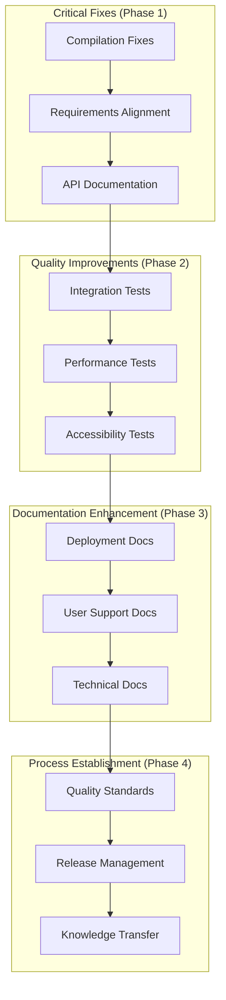

# Documentation & Quality Improvements Design Document

## Overview

This design document outlines the technical approach for addressing critical documentation gaps, quality issues, and alignment discrepancies in the Ashfolio project. The design focuses on systematic resolution of compilation issues, documentation alignment, and establishment of comprehensive testing and quality assurance procedures.

### Core Design Principles

- **Systematic Resolution**: Address issues in order of criticality and dependency
- **Documentation-First**: Ensure all changes are properly documented before implementation
- **Quality Gates**: Establish automated quality checks to prevent regression
- **Maintainability Focus**: Design solutions that are sustainable long-term
- **Minimal Disruption**: Fix issues without breaking existing functionality

## Architecture

### High-Level Improvement Architecture



## Components and Interfaces

### 1. Compilation Issues Resolution

#### PubSub Module Fixes

```elixir
# Current Issue: Incorrect PubSub usage
# Fix: Use proper Phoenix.PubSub module structure

defmodule Ashfolio.PubSub do
  @moduledoc """
  PubSub wrapper for Ashfolio application events.
  Provides consistent interface for broadcasting and subscribing to application events.
  """

  @pubsub Ashfolio.PubSub

  @doc """
  Broadcast a message to all subscribers of a topic.
  """
  def broadcast(topic, message) do
    Phoenix.PubSub.broadcast(@pubsub, topic, message)
  end

  @doc """
  Broadcast a message to all subscribers of a topic, raising on failure.
  """
  def broadcast!(topic, message) do
    Phoenix.PubSub.broadcast!(@pubsub, topic, message)
  end

  @doc """
  Subscribe to a topic.
  """
  def subscribe(topic) do
    Phoenix.PubSub.subscribe(@pubsub, topic)
  end

  @doc """
  Unsubscribe from a topic.
  """
  def unsubscribe(topic) do
    Phoenix.PubSub.unsubscribe(@pubsub, topic)
  end
end
```

#### Ash Framework Function Corrections

```elixir
# Fix undefined Ash function calls
defmodule Ashfolio.Portfolio.Symbol do
  # Current Issue: Symbol.list_symbols!/0 undefined
  # Fix: Use proper Ash query interface

  def list_symbols do
    __MODULE__
    |> Ash.Query.new()
    |> Ash.read()
  end

  def list_symbols! do
    case list_symbols() do
      {:ok, symbols} -> symbols
      {:error, error} -> raise error
    end
  end
end

# Fix changeset function calls
defmodule Ashfolio.Portfolio.Transaction do
  # Current Issue: Transaction.changeset_for_create/1 undefined
  # Fix: Use proper Ash changeset interface

  def changeset_for_create(attrs \\ %{}) do
    __MODULE__
    |> Ash.Changeset.for_create(:create, attrs)
  end

  def changeset_for_update(transaction, attrs) do
    transaction
    |> Ash.Changeset.for_update(:update, attrs)
  end
end
```

#### Component Attribute Fixes

```elixir
# Fix undefined component attributes
# Remove unsupported 'size' and 'variant' attributes from button components

# Before (incorrect):
# <.button size="sm" variant="outline">Edit</.button>

# After (correct):
# <.button class="text-sm border border-gray-300">Edit</.button>
```

### 2. Requirements-Implementation Alignment

#### Market Data Requirements Update

```markdown
# Updated Requirement 4.4 (Market Data Management)

WHEN market data is needed THEN it SHALL fetch and cache current prices using manual refresh triggered by user action
WHEN a user requests price updates THEN it SHALL use Yahoo Finance API with ETS caching for performance
WHEN market data is stale THEN it SHALL display last updated timestamp and provide manual refresh option
WHEN external APIs are unavailable THEN the system SHALL gracefully degrade and use cached prices with staleness indicators
```

#### Transaction Types Alignment

```markdown
# Updated Requirement 3.1 (Transaction Types)

WHEN a user creates a transaction THEN the system SHALL support transaction types: BUY, SELL, DIVIDEND, FEE, INTEREST
WHEN transaction validation occurs THEN it SHALL enforce type-specific validation rules for each supported type
```

### 3. API Documentation Structure

#### REST API Documentation Template

```markdown
# Ashfolio Local REST API Documentation

## Overview

The Ashfolio application provides a local REST API for accessing portfolio data. The API is available only on localhost and requires no authentication.

## Base URL
```

http://localhost:4000/api/v1

````

## Endpoints

### Portfolio Summary
```http
GET /api/v1/portfolio/summary
````

**Response:**

```json
{
  "total_value": "25000.00",
  "total_return": "2500.00",
  "total_return_percent": "11.11",
  "holdings_count": 5,
  "last_updated": "2025-08-06T10:30:00Z"
}
```

### Holdings List

```http
GET /api/v1/holdings
```

**Response:**

```json
{
  "holdings": [
    {
      "symbol": "AAPL",
      "name": "Apple Inc.",
      "quantity": "100.00",
      "current_price": "150.00",
      "current_value": "15000.00",
      "cost_basis": "13500.00",
      "unrealized_pnl": "1500.00",
      "unrealized_pnl_pct": "11.11"
    }
  ]
}
```

````

### 4. Integration Testing Framework

#### Test Structure Design

```elixir
defmodule AshfolioWeb.IntegrationTest do
  use AshfolioWeb.ConnCase
  use AshfolioWeb.LiveViewCase

  describe "complete account management workflow" do
    test "user can create, edit, and delete accounts", %{conn: conn} do
      # 1. Navigate to accounts page
      {:ok, index_live, _html} = live(conn, ~p"/accounts")

      # 2. Create new account
      index_live
      |> element("button", "New Account")
      |> render_click()

      # 3. Fill and submit form
      index_live
      |> form("#account-form", account: %{name: "Test Account", platform: "Test"})
      |> render_submit()

      # 4. Verify account appears in list
      assert has_element?(index_live, "[data-testid='account-Test Account']")

      # 5. Edit account
      index_live
      |> element("[data-testid='edit-account']")
      |> render_click()

      # 6. Update and verify changes
      index_live
      |> form("#account-form", account: %{name: "Updated Account"})
      |> render_submit()

      assert has_element?(index_live, "[data-testid='account-Updated Account']")

      # 7. Delete account
      index_live
      |> element("[data-testid='delete-account']")
      |> render_click()

      # 8. Verify account removed
      refute has_element?(index_live, "[data-testid='account-Updated Account']")
    end
  end

  describe "complete transaction workflow" do
    test "user can create transactions and see portfolio updates", %{conn: conn} do
      # Setup: Create account and symbol
      {:ok, account} = create_test_account()
      {:ok, symbol} = create_test_symbol()

      # 1. Navigate to transactions
      {:ok, transaction_live, _html} = live(conn, ~p"/transactions")

      # 2. Create buy transaction
      create_transaction(transaction_live, %{
        type: "BUY",
        symbol_id: symbol.id,
        account_id: account.id,
        quantity: "100",
        price: "150.00"
      })

      # 3. Verify transaction appears
      assert has_element?(transaction_live, "[data-testid='transaction-BUY-#{symbol.symbol}']")

      # 4. Navigate to dashboard
      {:ok, dashboard_live, _html} = live(conn, ~p"/")

      # 5. Verify portfolio calculations updated
      assert has_element?(dashboard_live, "[data-testid='portfolio-value']", "$15,000.00")

      # 6. Test price refresh
      dashboard_live
      |> element("[data-testid='refresh-prices']")
      |> render_click()

      # 7. Verify updated calculations
      assert has_element?(dashboard_live, "[data-testid='last-updated']")
    end
  end
end
````

### 5. Performance Testing Framework

#### Load Testing Design

```elixir
defmodule Ashfolio.PerformanceTest do
  use ExUnit.Case

  @moduletag :performance

  describe "portfolio performance with large datasets" do
    test "handles 1000+ transactions efficiently" do
      # Setup: Create 1000 transactions
      transactions = create_large_transaction_dataset(1000)

      # Test: Portfolio calculation performance
      {time_microseconds, {:ok, portfolio_data}} =
        :timer.tc(fn ->
          Ashfolio.Portfolio.Calculator.calculate_total_return()
        end)

      # Verify: Calculation completes within performance threshold
      time_milliseconds = time_microseconds / 1000
      assert time_milliseconds < 100, "Portfolio calculation took #{time_milliseconds}ms, expected < 100ms"

      # Verify: Results are accurate
      assert portfolio_data.total_value
      assert portfolio_data.return_percentage
    end

    test "page load performance meets requirements" do
      # Setup: Create realistic dataset
      setup_realistic_portfolio_data()

      # Test: Dashboard page load time
      {time_microseconds, {:ok, _view, _html}} =
        :timer.tc(fn ->
          live(build_conn(), ~p"/")
        end)

      # Verify: Page loads within 500ms threshold
      time_milliseconds = time_microseconds / 1000
      assert time_milliseconds < 500, "Dashboard load took #{time_milliseconds}ms, expected < 500ms"
    end
  end
end
```

### 6. Accessibility Testing Procedures

#### WCAG AA Compliance Checklist

```markdown
# Accessibility Testing Checklist

## Color Contrast Testing

- [ ] All text has minimum 4.5:1 contrast ratio
- [ ] Large text (18pt+) has minimum 3:1 contrast ratio
- [ ] Interactive elements have sufficient contrast
- [ ] Focus indicators are clearly visible

## Keyboard Navigation Testing

- [ ] All interactive elements are keyboard accessible
- [ ] Tab order is logical and intuitive
- [ ] Focus is properly managed in modals and forms
- [ ] Keyboard shortcuts don't conflict with assistive technology

## Screen Reader Testing

- [ ] All images have appropriate alt text
- [ ] Form fields have proper labels
- [ ] Tables have appropriate headers
- [ ] ARIA labels are used where needed
- [ ] Page structure is semantic and logical

## Testing Tools

- axe-core browser extension
- WAVE Web Accessibility Evaluator
- Lighthouse accessibility audit
- Manual keyboard navigation testing
- Screen reader testing (NVDA, JAWS, VoiceOver)
```

### 7. Documentation Structure Design

#### Documentation Organization

```
docs/
├── api/
│   ├── rest-api.md
│   └── endpoints.md
├── deployment/
│   ├── production-setup.md
│   ├── environment-config.md
│   └── backup-procedures.md
├── development/
│   ├── getting-started.md
│   ├── coding-standards.md
│   └── testing-guide.md
├── operations/
│   ├── monitoring.md
│   ├── troubleshooting.md
│   └── maintenance.md
└── user/
    ├── user-guide.md
    ├── troubleshooting.md
    └── faq.md
```

## Error Handling and Quality Gates

### Automated Quality Checks

```elixir
# .github/workflows/quality.yml
name: Quality Checks

on: [push, pull_request]

jobs:
  quality:
    runs-on: ubuntu-latest
    steps:
      - uses: actions/checkout@v2

      - name: Setup Elixir
        uses: erlef/setup-beam@v1
        with:
          elixir-version: '1.15'
          otp-version: '26'

      - name: Install dependencies
        run: mix deps.get

      - name: Check compilation
        run: mix compile --warnings-as-errors

      - name: Run tests
        run: mix test

      - name: Check formatting
        run: mix format --check-formatted

      - name: Run static analysis
        run: mix credo --strict

      - name: Check documentation
        run: mix docs
```

### Quality Gates Implementation

```elixir
defmodule Ashfolio.QualityGates do
  @moduledoc """
  Quality gates for ensuring code quality and preventing regressions.
  """

  def check_compilation do
    case System.cmd("mix", ["compile", "--warnings-as-errors"]) do
      {_, 0} -> :ok
      {output, _} -> {:error, "Compilation failed: #{output}"}
    end
  end

  def check_test_coverage do
    case System.cmd("mix", ["test", "--cover"]) do
      {output, 0} ->
        coverage = extract_coverage_percentage(output)
        if coverage >= 90 do
          :ok
        else
          {:error, "Test coverage #{coverage}% below required 90%"}
        end
      {output, _} -> {:error, "Tests failed: #{output}"}
    end
  end

  def check_documentation_coverage do
    # Verify all public functions have documentation
    # Check for missing @doc attributes
    # Validate documentation examples
  end
end
```

## Testing Strategy

### Test Categories

1. **Unit Tests**: Individual module and function testing
2. **Integration Tests**: Cross-module workflow testing
3. **Performance Tests**: Load and performance validation
4. **Accessibility Tests**: WCAG compliance validation
5. **Documentation Tests**: Documentation accuracy and completeness

### Test Execution Strategy

```bash
# Development workflow
just test                    # Quick unit tests
just test-integration       # Integration tests
just test-performance       # Performance validation
just test-accessibility     # Accessibility checks
just test-all               # Complete test suite

# CI/CD pipeline
mix test --cover            # Unit tests with coverage
mix test --only integration # Integration tests
mix test --only performance # Performance tests
```

## Implementation Phases

### Phase 1: Critical Fixes (Week 1)

- Fix all compilation issues
- Align requirements documentation
- Create basic API documentation

### Phase 2: Quality Improvements (Week 2)

- Implement integration test suite
- Add performance validation tests
- Establish accessibility testing procedures

### Phase 3: Documentation Enhancement (Week 3)

- Create deployment documentation
- Write user support documentation
- Develop technical documentation

### Phase 4: Process Establishment (Week 4)

- Implement quality standards
- Establish release management procedures
- Create knowledge transfer documentation

## Success Criteria

### Definition of Done

- All compilation warnings and errors resolved
- Requirements documentation aligned with implementation
- Comprehensive API documentation created
- Integration test suite implemented and passing
- Performance benchmarks established and met
- Accessibility testing procedures documented
- Deployment and operations documentation complete

### Quality Metrics

- 0 compilation warnings/errors
- 90%+ test coverage maintained
- All integration workflows tested
- Performance requirements met
- WCAG AA compliance verified
- Documentation completeness validated

## Maintenance and Evolution

### Ongoing Quality Assurance

- Automated quality checks in CI/CD
- Regular documentation reviews
- Performance monitoring and alerting
- Accessibility audit schedule
- Technical debt tracking and management

### Future Enhancements

- Advanced performance monitoring
- Automated accessibility testing
- Documentation generation from code
- Enhanced error tracking and reporting
- Continuous quality improvement processes
