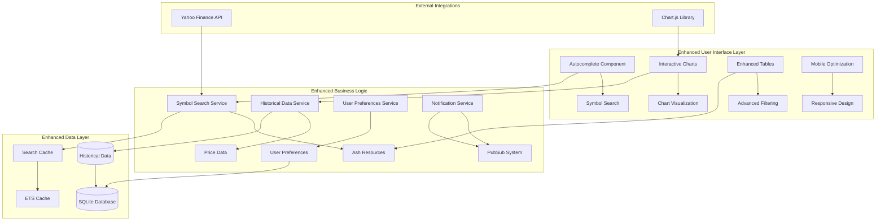

# Ashfolio User Experience Enhancements Design Document

## Overview

This design document outlines the technical architecture and implementation approach for enhancing Ashfolio's user experience. The enhancements build upon the existing v0.1.0 foundation to deliver intelligent forms, interactive visualizations, and streamlined workflows while maintaining the application's performance and reliability standards.

### Core Design Principles

- **Progressive Enhancement**: Build upon existing v0.1.0 architecture without breaking changes
- **Performance First**: Maintain sub-2-second load times and responsive interactions
- **Accessibility by Design**: WCAG AA compliance integrated from the start
- **Mobile-First**: Responsive design optimized for all device sizes
- **Real-Time Updates**: Leverage Phoenix LiveView for seamless user experience
- **Maintainable Code**: Follow established Ash Framework and Phoenix patterns

## Architecture

### High-Level Enhancement Architecture



### Technology Stack Enhancements

- **Frontend Enhancements**: Chart.js for interactive charts, enhanced Tailwind CSS components
- **Backend Services**: New Ash resources for historical data and user preferences
- **Real-Time Features**: Enhanced Phoenix PubSub for notifications and live updates
- **Search & Autocomplete**: Optimized database queries with ETS caching
- **Mobile Optimization**: Progressive Web App (PWA) capabilities

## Components and Interfaces

### Enhanced Symbol Autocomplete System

#### Symbol Search Service

```elixir
defmodule Ashfolio.Portfolio.SymbolSearch do
  @moduledoc """
  Enhanced symbol search service with autocomplete and external API integration.
  Provides intelligent symbol suggestions with caching and rate limiting.
  """

  use GenServer
  require Logger

  # Public API
  def search_symbols(query, opts \\ []) do
    GenServer.call(__MODULE__, {:search, query, opts})
  end

  def get_symbol_suggestions(query) do
    with {:ok, local_results} <- search_local_symbols(query),
         {:ok, external_results} <- search_external_symbols(query) do
      combined_results = combine_and_rank_results(local_results, external_results)
      {:ok, combined_results}
    end
  end

  # Implementation
  defp search_local_symbols(query) do
    # Search existing Symbol resources using Ash queries
    Symbol
    |> Ash.Query.filter(
      contains(symbol, ^query) or
      contains(name, ^query)
    )
    |> Ash.Query.sort([:symbol])
    |> Ash.Query.limit(10)
    |> Ash.read()
  end

  defp search_external_symbols(query) do
    case get_cached_external_search(query) do
      {:ok, cached_results} -> {:ok, cached_results}
      :not_found -> fetch_and_cache_external_symbols(query)
    end
  end

  defp fetch_and_cache_external_symbols(query) do
    with {:ok, results} <- YahooFinance.search_symbols(query) do
      cache_external_search(query, results)
      {:ok, results}
    else
      {:error, reason} ->
        Logger.warning("External symbol search failed: #{inspect(reason)}")
        {:ok, []} # Graceful degradation
    end
  end
end
```

#### Autocomplete LiveView Component

```elixir
defmodule AshfolioWeb.Components.SymbolAutocomplete do
  use AshfolioWeb, :live_component

  @impl true
  def update(assigns, socket) do
    socket =
      socket
      |> assign(assigns)
      |> assign(:suggestions, [])
      |> assign(:loading, false)
      |> assign(:selected_index, -1)

    {:ok, socket}
  end

  @impl true
  def handle_event("search", %{"query" => query}, socket) when byte_size(query) >= 2 do
    send(self(), {:search_symbols, query})

    socket =
      socket
      |> assign(:loading, true)
      |> assign(:query, query)

    {:noreply, socket}
  end

  def handle_event("search", %{"query" => query}, socket) do
    socket =
      socket
      |> assign(:suggestions, [])
      |> assign(:query, query)
      |> assign(:loading, false)

    {:noreply, socket}
  end

  def handle_event("select", %{"symbol" => symbol_data}, socket) do
    # Parse symbol data and send to parent
    symbol = Jason.decode!(symbol_data)
    send(self(), {:symbol_selected, symbol})

    socket =
      socket
      |> assign(:suggestions, [])
      |> assign(:query, symbol["symbol"])

    {:noreply, socket}
  end

  @impl true
  def handle_info({:search_results, results}, socket) do
    socket =
      socket
      |> assign(:suggestions, results)
      |> assign(:loading, false)

    {:noreply, socket}
  end

  def render(assigns) do
    ~H"""
    <div class="relative">
      <input
        type="text"
        value={@query}
        placeholder="Search symbols..."
        phx-keyup="search"
        phx-target={@myself}
        phx-debounce="300"
        class="w-full px-3 py-2 border border-gray-300 rounded-md focus:outline-none focus:ring-2 focus:ring-blue-500"
      />

      <%= if @loading do %>
        <div class="absolute right-3 top-3">
          <div class="animate-spin h-4 w-4 border-2 border-blue-500 border-t-transparent rounded-full"></div>
        </div>
      <% end %>

      <%= if length(@suggestions) > 0 do %>
        <div class="absolute z-10 w-full mt-1 bg-white border border-gray-300 rounded-md shadow-lg max-h-60 overflow-auto">
          <%= for {suggestion, index} <- Enum.with_index(@suggestions) do %>
            <button
              type="button"
              phx-click="select"
              phx-value-symbol={Jason.encode!(suggestion)}
              phx-target={@myself}
              class={[
                "w-full px-4 py-2 text-left hover:bg-gray-100 focus:bg-gray-100 focus:outline-none",
                index == @selected_index && "bg-gray-100"
              ]}
            >
              <div class="flex justify-between items-center">
                <div>
                  <div class="font-semibold text-gray-900"><%= suggestion.symbol %></div>
                  <div class="text-sm text-gray-600"><%= suggestion.name %></div>
                </div>
                <%= if suggestion.current_price do %>
                  <div class="text-sm font-medium text-gray-900">
                    <%= FormatHelpers.format_currency(suggestion.current_price) %>
                  </div>
                <% end %>
              </div>
            </button>
          <% end %>
        </div>
      <% end %>
    </div>
    """
  end
end
```

### Real-Time Price Lookup Integration

#### Enhanced Price Manager

```elixir
defmodule Ashfolio.MarketData.EnhancedPriceManager do
  use GenServer
  require Logger

  @moduledoc """
  Enhanced price manager with real-time lookup capabilities and improved caching.
  Supports individual symbol price fetching for transaction forms.
  """

  # Public API
  def fetch_symbol_price(symbol) do
    GenServer.call(__MODULE__, {:fetch_symbol_price, symbol})
  end

  def get_market_status() do
    GenServer.call(__MODULE__, :get_market_status)
  end

  # Implementation
  def handle_call({:fetch_symbol_price, symbol}, _from, state) do
    case get_cached_price(symbol) do
      {:ok, price_data} when is_recent?(price_data.updated_at) ->
        {:reply, {:ok, price_data}, state}

      _ ->
        case fetch_fresh_price(symbol) do
          {:ok, price_data} ->
            cache_price(symbol, price_data)
            {:reply, {:ok, price_data}, state}

          {:error, reason} ->
            # Try to return stale cached data as fallback
            case get_cached_price(symbol) do
              {:ok, stale_data} ->
                {:reply, {:ok, %{stale_data | stale: true}}, state}
              _ ->
                {:reply, {:error, reason}, state}
            end
        end
    end
  end

  defp fetch_fresh_price(symbol) do
    with {:ok, price_data} <- YahooFinance.fetch_price(symbol),
         {:ok, market_status} <- YahooFinance.get_market_status() do

      enhanced_data = %{
        symbol: symbol,
        price: price_data.price,
        updated_at: DateTime.utc_now(),
        market_status: market_status,
        stale: false
      }

      {:ok, enhanced_data}
    end
  end

  defp is_recent?(timestamp) do
    DateTime.diff(DateTime.utc_now(), timestamp, :minute) < 15
  end
end
```

### Interactive Dashboard Charts

#### Chart Data Service

```elixir
defmodule Ashfolio.Portfolio.ChartDataService do
  @moduledoc """
  Service for generating chart data for portfolio visualization.
  Provides historical performance and allocation data.
  """

  def get_portfolio_performance_data(user_id, period \\ :month) do
    with {:ok, historical_data} <- get_historical_portfolio_values(user_id, period) do
      chart_data = %{
        labels: Enum.map(historical_data, & &1.date),
        datasets: [
          %{
            label: "Portfolio Value",
            data: Enum.map(historical_data, & &1.total_value),
            borderColor: "rgb(59, 130, 246)",
            backgroundColor: "rgba(59, 130, 246, 0.1)",
            tension: 0.1
          }
        ]
      }
      {:ok, chart_data}
    end
  end

  def get_allocation_data(user_id, dimension \\ :asset_class) do
    with {:ok, holdings} <- HoldingsCalculator.get_holdings_summary(user_id) do
      allocation_data =
        holdings.holdings
        |> group_by_dimension(dimension)
        |> calculate_percentages()
        |> format_for_pie_chart()

      {:ok, allocation_data}
    end
  end

  defp get_historical_portfolio_values(user_id, period) do
    # Query historical data from new PortfolioSnapshot resource
    date_range = get_date_range(period)

    PortfolioSnapshot
    |> Ash.Query.filter(user_id == ^user_id)
    |> Ash.Query.filter(date >= ^date_range.start_date)
    |> Ash.Query.filter(date <= ^date_range.end_date)
    |> Ash.Query.sort([:date])
    |> Ash.read()
  end
end
```

#### Chart LiveView Component

```elixir
defmodule AshfolioWeb.Components.InteractiveChart do
  use AshfolioWeb, :live_component

  @impl true
  def update(assigns, socket) do
    socket =
      socket
      |> assign(assigns)
      |> assign(:loading, true)
      |> load_chart_data()

    {:ok, socket}
  end

  defp load_chart_data(socket) do
    user_id = socket.assigns.user_id
    chart_type = socket.assigns.chart_type

    case chart_type do
      :performance ->
        case ChartDataService.get_portfolio_performance_data(user_id) do
          {:ok, data} -> assign(socket, chart_data: data, loading: false)
          {:error, _} -> assign(socket, chart_data: nil, loading: false, error: "Failed to load chart data")
        end

      :allocation ->
        case ChartDataService.get_allocation_data(user_id) do
          {:ok, data} -> assign(socket, chart_data: data, loading: false)
          {:error, _} -> assign(socket, chart_data: nil, loading: false, error: "Failed to load chart data")
        end
    end
  end

  def render(assigns) do
    ~H"""
    <div class="bg-white rounded-lg shadow p-6">
      <h3 class="text-lg font-semibold text-gray-900 mb-4"><%= @title %></h3>

      <%= if @loading do %>
        <div class="flex items-center justify-center h-64">
          <div class="animate-spin h-8 w-8 border-4 border-blue-500 border-t-transparent rounded-full"></div>
        </div>
      <% else %>
        <%= if @chart_data do %>
          <div
            id={"chart-#{@id}"}
            phx-hook="InteractiveChart"
            data-chart-type={@chart_type}
            data-chart-data={Jason.encode!(@chart_data)}
            class="h-64"
          >
          </div>
        <% else %>
          <div class="flex items-center justify-center h-64 text-gray-500">
            <%= @error || "No data available for chart" %>
          </div>
        <% end %>
      <% end %>
    </div>
    """
  end
end
```

### Enhanced Holdings Table with Advanced Features

#### Advanced Table Component

```elixir
defmodule AshfolioWeb.Components.AdvancedHoldingsTable do
  use AshfolioWeb, :live_component

  @impl true
  def update(assigns, socket) do
    socket =
      socket
      |> assign(assigns)
      |> assign_default_table_state()
      |> load_and_filter_holdings()

    {:ok, socket}
  end

  defp assign_default_table_state(socket) do
    socket
    |> assign(:sort_by, :symbol)
    |> assign(:sort_order, :asc)
    |> assign(:filters, %{})
    |> assign(:selected_rows, MapSet.new())
    |> assign(:page, 1)
    |> assign(:per_page, 25)
  end

  @impl true
  def handle_event("sort", %{"column" => column}, socket) do
    column_atom = String.to_existing_atom(column)
    {sort_by, sort_order} = toggle_sort(socket.assigns.sort_by, socket.assigns.sort_order, column_atom)

    socket =
      socket
      |> assign(:sort_by, sort_by)
      |> assign(:sort_order, sort_order)
      |> load_and_filter_holdings()

    {:noreply, socket}
  end

  def handle_event("filter", %{"filter" => filter_params}, socket) do
    filters = parse_filters(filter_params)

    socket =
      socket
      |> assign(:filters, filters)
      |> assign(:page, 1) # Reset to first page when filtering
      |> load_and_filter_holdings()

    {:noreply, socket}
  end

  def handle_event("select_row", %{"symbol_id" => symbol_id}, socket) do
    selected_rows =
      if MapSet.member?(socket.assigns.selected_rows, symbol_id) do
        MapSet.delete(socket.assigns.selected_rows, symbol_id)
      else
        MapSet.put(socket.assigns.selected_rows, symbol_id)
      end

    {:noreply, assign(socket, :selected_rows, selected_rows)}
  end

  def handle_event("bulk_action", %{"action" => action}, socket) do
    selected_ids = MapSet.to_list(socket.assigns.selected_rows)

    case action do
      "refresh_prices" ->
        send(self(), {:bulk_refresh_prices, selected_ids})
      "export_data" ->
        send(self(), {:bulk_export, selected_ids})
    end

    {:noreply, assign(socket, :selected_rows, MapSet.new())}
  end

  defp load_and_filter_holdings(socket) do
    user_id = socket.assigns.user_id

    with {:ok, holdings_summary} <- HoldingsCalculator.get_holdings_summary(user_id) do
      filtered_holdings =
        holdings_summary.holdings
        |> apply_filters(socket.assigns.filters)
        |> sort_holdings(socket.assigns.sort_by, socket.assigns.sort_order)
        |> paginate_holdings(socket.assigns.page, socket.assigns.per_page)

      socket
      |> assign(:holdings, filtered_holdings.items)
      |> assign(:total_pages, filtered_holdings.total_pages)
      |> assign(:total_count, filtered_holdings.total_count)
    else
      {:error, reason} ->
        Logger.error("Failed to load holdings: #{inspect(reason)}")
        assign(socket, :holdings, [])
    end
  end

  def render(assigns) do
    ~H"""
    <div class="bg-white rounded-lg shadow">
      <!-- Filter Controls -->
      <div class="p-4 border-b border-gray-200">
        <div class="flex flex-wrap gap-4">
          <div class="flex-1 min-w-64">
            <input
              type="text"
              placeholder="Search holdings..."
              phx-keyup="filter"
              phx-debounce="300"
              phx-target={@myself}
              class="w-full px-3 py-2 border border-gray-300 rounded-md focus:outline-none focus:ring-2 focus:ring-blue-500"
            />
          </div>

          <select
            phx-change="filter"
            phx-target={@myself}
            name="asset_class"
            class="px-3 py-2 border border-gray-300 rounded-md focus:outline-none focus:ring-2 focus:ring-blue-500"
          >
            <option value="">All Asset Classes</option>
            <option value="stock">Stocks</option>
            <option value="etf">ETFs</option>
            <option value="crypto">Crypto</option>
          </select>

          <%= if MapSet.size(@selected_rows) > 0 do %>
            <div class="flex gap-2">
              <button
                phx-click="bulk_action"
                phx-value-action="refresh_prices"
                phx-target={@myself}
                class="px-4 py-2 bg-blue-600 text-white rounded-md hover:bg-blue-700"
              >
                Refresh Prices (<%= MapSet.size(@selected_rows) %>)
              </button>

              <button
                phx-click="bulk_action"
                phx-value-action="export_data"
                phx-target={@myself}
                class="px-4 py-2 bg-green-600 text-white rounded-md hover:bg-green-700"
              >
                Export Selected
              </button>
            </div>
          <% end %>
        </div>
      </div>

      <!-- Holdings Table -->
      <div class="overflow-x-auto">
        <table class="min-w-full divide-y divide-gray-200">
          <thead class="bg-gray-50">
            <tr>
              <th class="px-6 py-3 text-left">
                <input
                  type="checkbox"
                  phx-click="select_all"
                  phx-target={@myself}
                  class="rounded border-gray-300 text-blue-600 focus:ring-blue-500"
                />
              </th>

              <%= for {column, label} <- table_columns() do %>
                <th
                  phx-click="sort"
                  phx-value-column={column}
                  phx-target={@myself}
                  class="px-6 py-3 text-left text-xs font-medium text-gray-500 uppercase tracking-wider cursor-pointer hover:bg-gray-100"
                >
                  <div class="flex items-center gap-1">
                    <%= label %>
                    <%= if @sort_by == column do %>
                      <%= if @sort_order == :asc do %>
                        <svg class="w-4 h-4" fill="currentColor" viewBox="0 0 20 20">
                          <path d="M5.293 7.293a1 1 0 011.414 0L10 10.586l3.293-3.293a1 1 0 111.414 1.414l-4 4a1 1 0 01-1.414 0l-4-4a1 1 0 010-1.414z"/>
                        </svg>
                      <% else %>
                        <svg class="w-4 h-4" fill="currentColor" viewBox="0 0 20 20">
                          <path d="M14.707 12.707a1 1 0 01-1.414 0L10 9.414l-3.293 3.293a1 1 0 01-1.414-1.414l4-4a1 1 0 011.414 0l4 4a1 1 0 010 1.414z"/>
                        </svg>
                      <% end %>
                    <% end %>
                  </div>
                </th>
              <% end %>
            </tr>
          </thead>

          <tbody class="bg-white divide-y divide-gray-200">
            <%= for holding <- @holdings do %>
              <tr class={[
                "hover:bg-gray-50",
                MapSet.member?(@selected_rows, holding.symbol_id) && "bg-blue-50"
              ]}>
                <td class="px-6 py-4">
                  <input
                    type="checkbox"
                    checked={MapSet.member?(@selected_rows, holding.symbol_id)}
                    phx-click="select_row"
                    phx-value-symbol_id={holding.symbol_id}
                    phx-target={@myself}
                    class="rounded border-gray-300 text-blue-600 focus:ring-blue-500"
                  />
                </td>

                <td class="px-6 py-4 whitespace-nowrap">
                  <div class="font-semibold text-gray-900"><%= holding.symbol %></div>
                  <div class="text-sm text-gray-500"><%= holding.name %></div>
                </td>

                <td class="px-6 py-4 whitespace-nowrap text-right">
                  <%= FormatHelpers.format_quantity(holding.quantity) %>
                </td>

                <td class="px-6 py-4 whitespace-nowrap text-right">
                  <%= FormatHelpers.format_currency(holding.current_price) %>
                </td>

                <td class="px-6 py-4 whitespace-nowrap text-right">
                  <%= FormatHelpers.format_currency(holding.current_value) %>
                </td>

                <td class="px-6 py-4 whitespace-nowrap text-right">
                  <div class={FormatHelpers.value_color_class(holding.unrealized_pnl)}>
                    <div><%= FormatHelpers.format_currency(holding.unrealized_pnl) %></div>
                    <div class="text-sm">(<%= FormatHelpers.format_percentage(holding.unrealized_pnl_pct) %>)</div>
                  </div>
                </td>
              </tr>
            <% end %>
          </tbody>
        </table>
      </div>

      <!-- Pagination -->
      <%= if @total_pages > 1 do %>
        <div class="px-6 py-3 border-t border-gray-200">
          <div class="flex items-center justify-between">
            <div class="text-sm text-gray-700">
              Showing <%= (@page - 1) * @per_page + 1 %> to <%= min(@page * @per_page, @total_count) %> of <%= @total_count %> holdings
            </div>

            <div class="flex gap-2">
              <%= for page_num <- pagination_range(@page, @total_pages) do %>
                <button
                  phx-click="paginate"
                  phx-value-page={page_num}
                  phx-target={@myself}
                  class={[
                    "px-3 py-2 text-sm rounded-md",
                    page_num == @page && "bg-blue-600 text-white",
                    page_num != @page && "bg-gray-100 text-gray-700 hover:bg-gray-200"
                  ]}
                >
                  <%= page_num %>
                </button>
              <% end %>
            </div>
          </div>
        </div>
      <% end %>
    </div>
    """
  end

  defp table_columns do
    [
      {:symbol, "Symbol"},
      {:quantity, "Quantity"},
      {:current_price, "Price"},
      {:current_value, "Value"},
      {:unrealized_pnl, "P&L"}
    ]
  end
end
```

## Data Models

### New Ash Resources for Enhanced Features

#### Portfolio Snapshot Resource

```elixir
defmodule Ashfolio.Portfolio.PortfolioSnapshot do
  use Ash.Resource,
    domain: Ashfolio.Portfolio,
    data_layer: AshSqlite.DataLayer

  @moduledoc """
  Stores daily portfolio snapshots for historical chart data.
  Automatically generated daily to track portfolio performance over time.
  """

  sqlite do
    table "portfolio_snapshots"
    repo Ashfolio.Repo
  end

  attributes do
    uuid_primary_key :id
    attribute :date, :date, allow_nil?: false
    attribute :total_value, :decimal, allow_nil?: false
    attribute :total_cost_basis, :decimal, allow_nil?: false
    attribute :total_return, :decimal, allow_nil?: false
    attribute :total_return_pct, :decimal, allow_nil?: false
    attribute :holdings_count, :integer, allow_nil?: false
    timestamps()
  end

  relationships do
    belongs_to :user, Ashfolio.Portfolio.User
  end

  actions do
    defaults [:read]

    create :create do
      accept [:date, :total_value, :total_cost_basis, :total_return, :total_return_pct, :holdings_count]
    end

    read :by_user_and_date_range do
      argument :user_id, :uuid, allow_nil?: false
      argument :start_date, :date, allow_nil?: false
      argument :end_date, :date, allow_nil?: false

      filter expr(
        user_id == ^arg(:user_id) and
        date >= ^arg(:start_date) and
        date <= ^arg(:end_date)
      )
    end

    read :latest_for_user do
      argument :user_id, :uuid, allow_nil?: false
      filter expr(user_id == ^arg(:user_id))
      sort date: :desc
      limit 1
    end
  end

  validations do
    validate compare(:date, less_than_or_equal_to: &Date.utc_today/0)
    validate compare(:total_value, greater_than_or_equal_to: 0)
  end

  identities do
    identity :unique_user_date, [:user_id, :date]
  end
end
```

#### User Preferences Resource

```elixir
defmodule Ashfolio.Portfolio.UserPreferences do
  use Ash.Resource,
    domain: Ashfolio.Portfolio,
    data_layer: AshSqlite.DataLayer

  @moduledoc """
  Stores user preferences for dashboard customization and table settings.
  """

  sqlite do
    table "user_preferences"
    repo Ashfolio.Repo
  end

  attributes do
    uuid_primary_key :id
    attribute :dashboard_layout, :map, default: %{}
    attribute :table_settings, :map, default: %{}
    attribute :chart_preferences, :map, default: %{}
    attribute :notification_settings, :map, default: %{}
    timestamps()
  end

  relationships do
    belongs_to :user, Ashfolio.Portfolio.User
  end

  actions do
    defaults [:create, :read, :update]

    read :for_user do
      argument :user_id, :uuid, allow_nil?: false
      filter expr(user_id == ^arg(:user_id))
    end

    update :update_dashboard_layout do
      accept [:dashboard_layout]
    end

    update :update_table_settings do
      accept [:table_settings]
    end
  end
end
```

#### Enhanced Symbol Resource

```elixir
# Extension to existing Symbol resource
defmodule Ashfolio.Portfolio.Symbol do
  # ... existing code ...

  attributes do
    # ... existing attributes ...

    # New attributes for enhanced search and metadata
    attribute :search_keywords, {:array, :string}, default: []
    attribute :market_cap, :decimal
    attribute :pe_ratio, :decimal
    attribute :dividend_yield, :decimal
    attribute :last_searched_at, :utc_datetime
    attribute :search_popularity, :integer, default: 0
  end

  actions do
    # ... existing actions ...

    read :search_symbols do
      argument :query, :string, allow_nil?: false

      prepare fn query, _context ->
        query_term = Ash.Query.get_argument(query, :query)

        query
        |> Ash.Query.filter(
          contains(symbol, ^query_term) or
          contains(name, ^query_term) or
          contains(search_keywords, ^query_term)
        )
        |> Ash.Query.sort([{:search_popularity, :desc}, {:symbol, :asc}])
        |> Ash.Query.limit(20)
      end
    end

    update :increment_search_popularity do
      change fn changeset, _context ->
        current_popularity = Ash.Changeset.get_attribute(changeset, :search_popularity) || 0

        changeset
        |> Ash.Changeset.change_attribute(:search_popularity, current_popularity + 1)
        |> Ash.Changeset.change_attribute(:last_searched_at, DateTime.utc_now())
      end
    end
  end
end
```

## Error Handling and System Resilience

### Enhanced Error Handling Strategy

```elixir
defmodule Ashfolio.UX.ErrorHandler do
  @moduledoc """
  Enhanced error handling for UX improvements with specific user guidance.
  """

  def handle_autocomplete_error(error, context \\ %{}) do
    case error do
      {:error, :network_timeout} ->
        %{
          type: :warning,
          message: "Symbol search is taking longer than usual. Showing local results only.",
          action: "Try again in a moment",
          recoverable: true
        }

      {:error, :rate_limited} ->
        %{
          type: :info,
          message: "Search rate limit reached. Using cached results.",
          action: "Wait a moment before searching again",
          recoverable: true
        }

      {:error, :invalid_query} ->
        %{
          type: :error,
          message: "Please enter at least 2 characters to search for symbols.",
          action: "Type more characters",
          recoverable: true
        }

      _ ->
        %{
          type: :error,
          message: "Symbol search temporarily unavailable.",
          action: "You can still enter symbols manually",
          recoverable: true
        }
    end
  end

  def handle_chart_error(error, chart_type) do
    case error do
      {:error, :insufficient_data} ->
        %{
          type: :info,
          message: get_insufficient_data_message(chart_type),
          action: get_data_suggestion(chart_type),
          recoverable: true
        }

      {:error, :calculation_failed} ->
        %{
          type: :warning,
          message: "Unable to calculate #{chart_type} data at this time.",
          action: "Try refreshing your portfolio data",
          recoverable: true
        }

      _ ->
        %{
          type: :error,
          message: "Chart temporarily unavailable.",
          action: "Data is still available in table format below",
          recoverable: true
        }
    end
  end

  defp get_insufficient_data_message(:performance) do
    "Portfolio performance chart needs at least 7 days of data to display meaningful trends."
  end

  defp get_insufficient_data_message(:allocation) do
    "Asset allocation chart needs at least one holding to display portfolio breakdown."
  end

  defp get_data_suggestion(:performance) do
    "Add some transactions and wait a few days for historical data to accumulate."
  end

  defp get_data_suggestion(:allocation) do
    "Add your first transaction to see portfolio allocation."
  end
end
```

### Performance Optimization Strategy

```elixir
defmodule Ashfolio.UX.PerformanceOptimizer do
  @moduledoc """
  Performance optimization utilities for enhanced UX features.
  """

  # Debounced search to prevent excessive API calls
  def debounced_search(query, delay \\ 300) do
    Process.send_after(self(), {:execute_search, query}, delay)
  end

  # Batch price updates for multiple symbols
  def batch_price_updates(symbol_ids, batch_size \\ 10) do
    symbol_ids
    |> Enum.chunk_every(batch_size)
    |> Enum.map(&fetch_prices_batch/1)
    |> Task.async_stream(&await_batch_result/1, timeout: 30_000)
    |> Enum.to_list()
  end

  # Preload chart data in background
  def preload_chart_data(user_id) do
    Task.start(fn ->
      ChartDataService.get_portfolio_performance_data(user_id)
      ChartDataService.get_allocation_data(user_id)
    end)
  end

  # Cache frequently accessed data
  def cache_user_preferences(user_id) do
    case UserPreferences.for_user(user_id) do
      {:ok, preferences} ->
        :ets.insert(:user_preferences_cache, {user_id, preferences})
        {:ok, preferences}
      error ->
        error
    end
  end
end
```

## Testing Strategy

### Enhanced Testing Approach

```elixir
defmodule AshfolioWeb.Components.SymbolAutocompleteTest do
  use AshfolioWeb.ConnCase, async: false
  import Phoenix.LiveViewTest

  describe "symbol autocomplete component" do
    test "shows suggestions when typing", %{conn: conn} do
      {:ok, view, _html} = live(conn, "/transactions/new")

      # Type in autocomplete field
      view
      |> element("#symbol-autocomplete input")
      |> render_keyup(%{"key" => "A", "value" => "AA"})

      # Should show loading state
      assert has_element?(view, ".animate-spin")

      # Mock search results
      send(view.pid, {:search_results, [
        %{symbol: "AAPL", name: "Apple Inc.", current_price: Decimal.new("150.00")}
      ]})

      # Should show suggestions
      assert has_element?(view, "[data-symbol='AAPL']")
      assert render(view) =~ "Apple Inc."
      assert render(view) =~ "$150.00"
    end

    test "handles API failures gracefully", %{conn: conn} do
      {:ok, view, _html} = live(conn, "/transactions/new")

      # Simulate API failure
      send(view.pid, {:search_error, :network_timeout})

      # Should show error message
      assert render(view) =~ "showing local results only"
      refute has_element?(view, ".animate-spin")
    end
  end
end

defmodule Ashfolio.Portfolio.ChartDataServiceTest do
  use Ashfolio.DataCase, async: false

  describe "portfolio performance data" do
    test "generates chart data for valid portfolio" do
      user = create_test_user()
      create_test_portfolio_snapshots(user.id)

      {:ok, chart_data} = ChartDataService.get_portfolio_performance_data(user.id)

      assert chart_data.labels |> length() > 0
      assert chart_data.datasets |> length() == 1
      assert chart_data.datasets |> hd() |> Map.get(:data) |> length() > 0
    end

    test "handles empty portfolio gracefully" do
      user = create_test_user()

      {:ok, chart_data} = ChartDataService.get_portfolio_performance_data(user.id)

      assert chart_data.labels == []
      assert chart_data.datasets |> hd() |> Map.get(:data) == []
    end
  end
end
```

This design document provides a comprehensive technical foundation for implementing the user experience enhancements while maintaining the existing architecture's strengths and ensuring scalability and maintainability.
