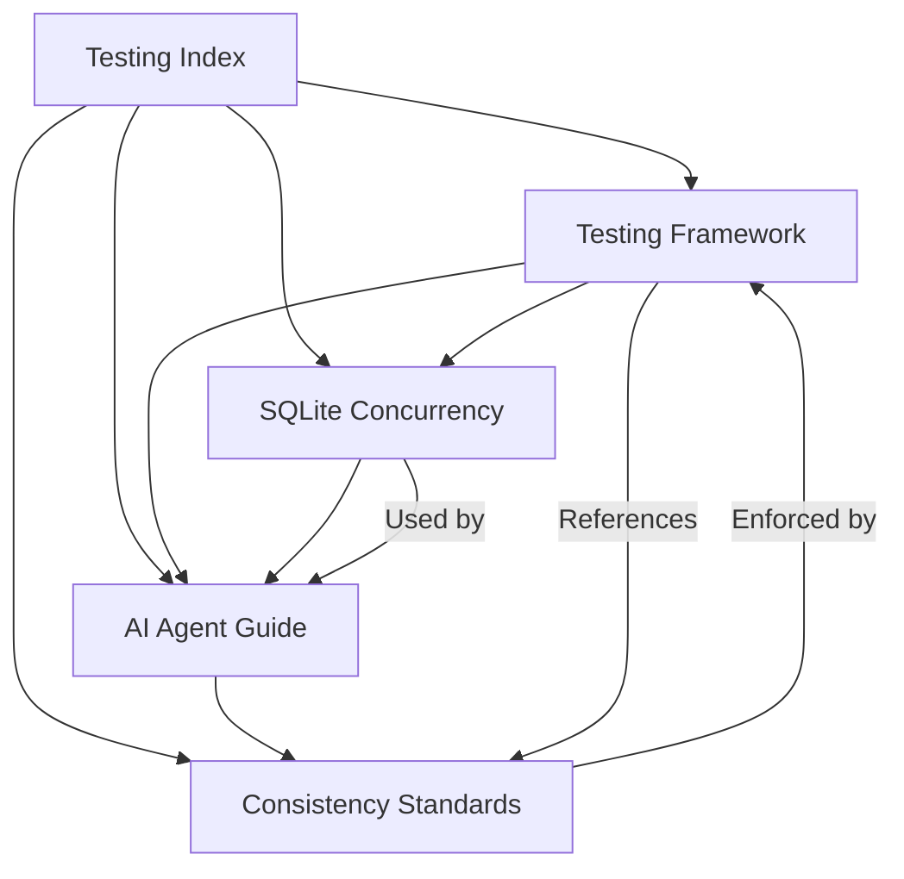

# Ashfolio Testing Documentation Index

## Overview

This index provides access to comprehensive testing documentation for the Ashfolio portfolio management application, with special focus on SQLite concurrency handling and AI agent development guidelines.

## Testing Documentation Suite

### 1. [Testing Framework](./TESTING_FRAMEWORK.md) 📋
**Primary testing guide for the entire project**
- Complete test suite structure and organization
- SQLite concurrency architecture and patterns
- Test execution with Just commands
- Troubleshooting guide for common issues
- **Target Audience**: All developers working on tests

### 2. [SQLite Concurrency Patterns](./SQLITE_CONCURRENCY_PATTERNS.md) 🔒
**Deep dive into SQLite-specific testing solutions**
- Global test data strategy to eliminate race conditions
- Retry logic with exponential backoff patterns
- GenServer database access handling
- Performance optimization techniques
- Migration guidance from PostgreSQL patterns
- **Target Audience**: Developers dealing with database concurrency issues

### 3. [AI Agent Testing Guide](./AI_AGENT_TESTING_GUIDE.md) 🤖
**Specialized guide for AI agents working on the test suite**
- Decision trees for test type selection
- Ready-to-use code templates and patterns
- Common pitfalls and their solutions
- Step-by-step debugging workflows
- Quality assurance checklists
- **Target Audience**: AI agents and automated development tools

### 4. [Test Consistency Standards](./TEST_CONSISTENCY_STANDARDS.md) ⚡
**Comprehensive standards for maintaining test quality**
- File organization and naming conventions
- Module structure templates for all test types
- Data usage standards and patterns
- Assertion guidelines and error handling
- Performance optimization standards
- **Target Audience**: Code reviewers and quality assurance

## Quick Reference

### For New Developers
1. Start with **[Testing Framework](./TESTING_FRAMEWORK.md)** for complete overview
2. Reference **[Test Consistency Standards](./TEST_CONSISTENCY_STANDARDS.md)** for code quality
3. Use **[SQLite Concurrency Patterns](./SQLITE_CONCURRENCY_PATTERNS.md)** when encountering database issues

### For AI Agents
1. Begin with **[AI Agent Testing Guide](./AI_AGENT_TESTING_GUIDE.md)** for templates and decision trees
2. Use quality checklists before code submission
3. Reference other documents for detailed implementation patterns

### Essential Commands
```bash
# Test specific file
just test-file test/path/to/test.exs

# Verbose output for debugging
just test-file-verbose test/path/to/test.exs

# Full test suite
just test

# Check compilation
just compile
```

## Document Relationships



## Project Integration

This testing documentation integrates with:

- **[CLAUDE.md](../CLAUDE.md)** - Main project instructions for AI agents
- **[.kiro/specs/tasks.md](../.kiro/specs/tasks.md)** - Implementation roadmap and task tracking
- **[test/test_helper.exs](../test/test_helper.exs)** - Global test configuration
- **[test/support/sqlite_helpers.ex](../test/support/sqlite_helpers.ex)** - Core helper functions

## Key Testing Principles

### SQLite-Specific Patterns
- **Always `async: false`** - SQLite requires single-threaded test execution
- **Global data first** - Use pre-created test data to avoid race conditions
- **Retry logic** - Handle "Database busy" errors with exponential backoff
- **GenServer permissions** - Special handling for cross-process database access

### Test Organization
- **Descriptive names** - Test functions should explain behavior clearly
- **Consistent structure** - Use standardized describe blocks and setup patterns
- **Error coverage** - Test both success and failure scenarios
- **Performance awareness** - Minimize database operations for faster execution

### AI Agent Guidelines
- **Use templates** - Start with provided code templates
- **Follow decision trees** - Use documented patterns for test type selection
- **Quality checklists** - Verify code meets standards before submission
- **Debug systematically** - Follow structured troubleshooting procedures

## Current Status

- **Test Suite**: 38+ test files covering comprehensive scenarios
- **Coverage**: Unit, Integration, and LiveView tests
- **Architecture**: Production-ready SQLite concurrency handling
- **Documentation**: Complete guidance for human and AI developers
- **Stability**: Robust patterns proven in production development

This documentation suite ensures consistent, reliable test development for the Ashfolio project while supporting both traditional development workflows and AI-assisted development processes.