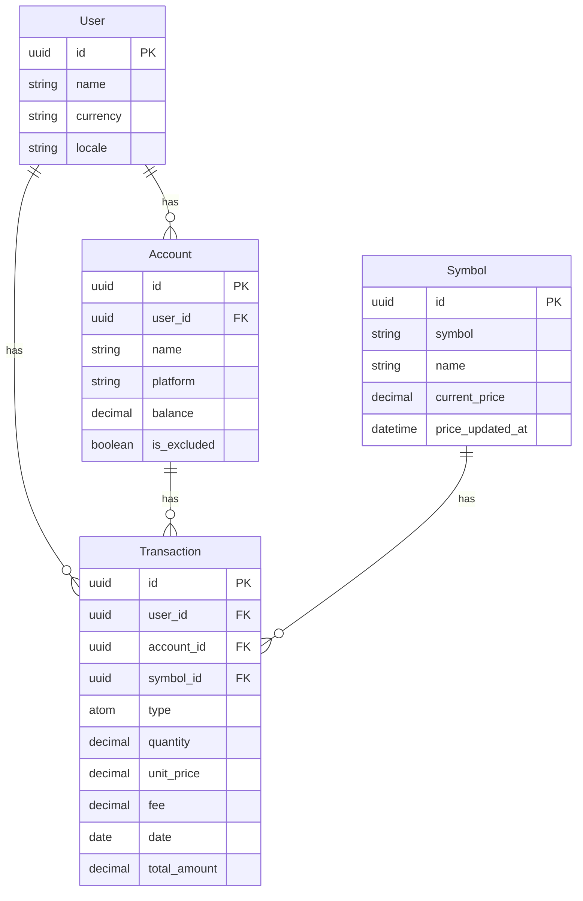

# Ashfolio Architecture Documentation

This document provides a detailed overview of Ashfolio's technical architecture, illustrating the relationships between its core components, modules, and data flows. Understanding this architecture is crucial for new developers to effectively contribute to the project.

**Note**: This architecture is evolving through the Financial Management Expansion roadmap (see [ADR-002](../architecture/adr-002-financial-domain-expansion.md)). Current documentation reflects the expanded scope from portfolio-only to comprehensive financial management.

## 1. Overall System Architecture

Ashfolio is built on the Phoenix LiveView framework, leveraging Elixir's OTP capabilities and the Ash Framework for robust data modeling and business logic. It follows a clear separation of concerns to ensure maintainability and extensibility.

```mermaid
graph TD
    subgraph "Ashfolio Comprehensive Financial Management (Elixir/Phoenix)"
        A[User Interface (Phoenix LiveView)] --> B{Business Logic Layer}
        B --> C[Data Layer]
        B --> D[Market Data Services]
        B --> H[Financial Calculation Engine]
        D --> E[ETS Cache]
        D --> F[External APIs (Yahoo Finance)]
        C --> G[(SQLite Database)]
        H --> I[Background Jobs (Oban)]
    end

    subgraph "Business Logic Layer (Dual Domain)"
        B1[Portfolio Domain] --> B2[Portfolio Calculators]
        B3[Financial Management Domain] --> B4[Net Worth Calculators]
        B3 --> B5[Expense Analyzers]
        B3 --> B6[Retirement Planners]
        B1 --> B7[Investment Resources]
        B3 --> B8[Financial Management Resources]
    end

    subgraph "Data Layer (Comprehensive)"
        C1[AshSqlite Data Layer] --> G
        C2[Time-Series Optimizations] --> G
        C3[Financial Analytics Queries] --> G
    end

    subgraph "Financial Calculation Engine"
        H1[Net Worth Calculations] --> H2[Retirement Projections]
        H2 --> H3[Tax Optimizations]
        H3 --> H4[Portfolio Analytics]
    end

    A -- "User Interactions" --> B
    B -- "Data Operations" --> C
    B -- "Price Requests" --> D
    B -- "Complex Calculations" --> H
    D -- "Cached Prices" --> E
    D -- "API Calls" --> F
    C -- "Data Storage" --> G
    E -- "Price Data" --> B
    H -- "Background Processing" --> I
    I -- "Completed Calculations" --> B
```

## 2. Ash Resources and Relationships

The Ash Framework forms the backbone of Ashfolio's data model and business logic. Each resource encapsulates a core domain concept and defines its attributes, relationships, and available actions.



## 3. LiveView Component Flow

Phoenix LiveView handles the dynamic user interface, providing real-time updates and interactive components. The application uses a component-based approach for UI modularity.

```mermaid
graph TD
    LV[LiveView Page (e.g., DashboardLive, AccountLive.Index)] --> LC[LiveComponent (e.g., FormComponent)]
    LV -- "mount/3 (initial state)" --> LV
    LV -- "handle_event/3 (user interaction)" --> LV
    LV -- "handle_info/3 (async updates)" --> LV
    LC -- "update/2 (component lifecycle)" --> LC
    LC -- "handle_event/3 (component interaction)" --> LC
    LC -- "send/2 (parent communication)" --> LV

    subgraph "Example: Account Management"
        ALI[AccountLive.Index] --> ALFC[AccountLive.FormComponent]
        ALI -- "new_account / edit_account events" --> ALFC
        ALFC -- "{:saved, account} / :cancel messages" --> ALI
        ALI -- "list_accounts()" --> AR[Account Ash Resource]
        ALFC -- "Account.create() / Account.update()" --> AR
    end
```

## 4. Market Data Flow

The market data system is responsible for fetching, caching, and providing current prices for symbols. It's designed for resilience and efficiency.

```mermaid
graph TD
    UI[User Interface (e.g., DashboardLive)] --> PM[PriceManager GenServer]
    PM -- "fetch_prices()" --> YF[YahooFinance Module]
    YF -- "HTTP Request" --> EXT[External Yahoo Finance API]
    EXT -- "Price Data (JSON)" --> YF
    YF -- "Parsed Price" --> PM
    PM -- "Cache Price" --> ETS[ETS Cache]
    ETS -- "Retrieve Price" --> PM
    PM -- "Update UI" --> UI

    subgraph "PriceManager Internal Flow"
        PMI[PriceManager] -- "Periodically / On Request" --> PMF[Fetch & Cache Logic]
        PMF -- "Update Symbol Resource" --> SR[Symbol Ash Resource]
    end
```

## 5. Ecto Schema (Underlying Ash Resources)

While Ash Resources provide the primary interface for data modeling, it's helpful to understand the underlying Ecto schemas that AshSqlite generates and manages. These represent the actual database table structures.

```mermaid
erDiagram
    users { 
        text id PK
        text name
        text currency
        text locale
        datetime inserted_at
        datetime updated_at
    }
    accounts {
        text id PK
        text user_id FK
        text name
        text platform
        text currency
        boolean is_excluded
        decimal balance
        datetime inserted_at
        datetime updated_at
    }
    symbols {
        text id PK
        text symbol UNIQUE
        text name
        text asset_class
        text currency
        text isin
        text sectors
        text countries
        text data_source
        decimal current_price
        datetime price_updated_at
        datetime inserted_at
        datetime updated_at
    }
    transactions {
        text id PK
        text user_id FK
        text account_id FK
        text symbol_id FK
        text type
        decimal quantity
        decimal unit_price
        decimal fee
        date date
        text currency
        text comment
        boolean is_draft
        datetime inserted_at
        datetime updated_at
    }
```
