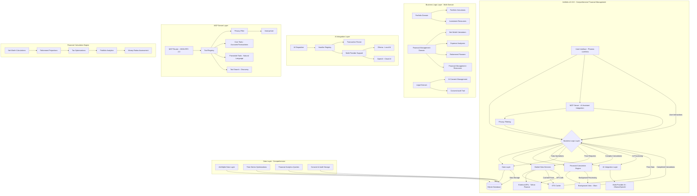
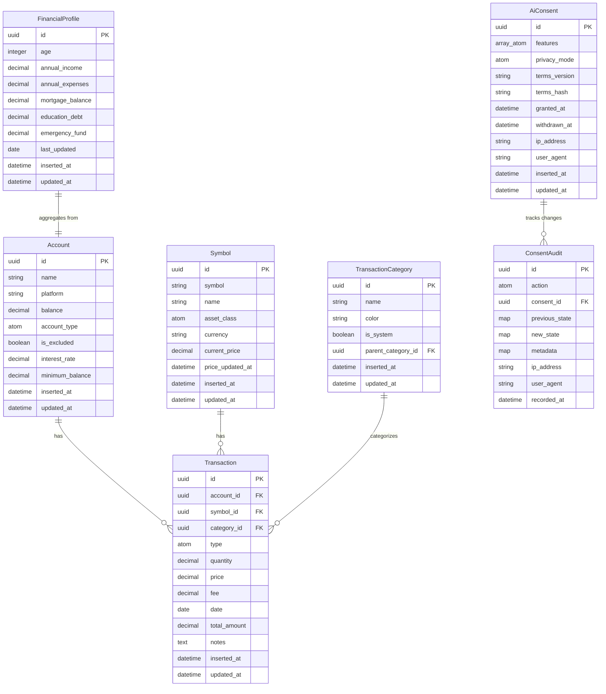
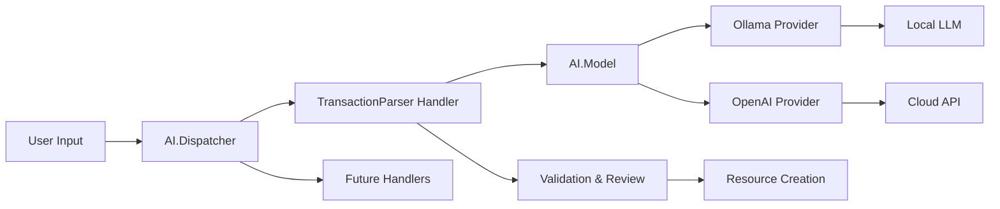
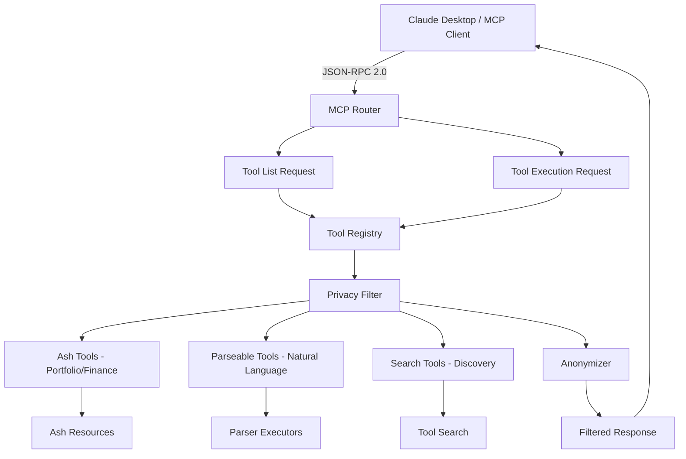
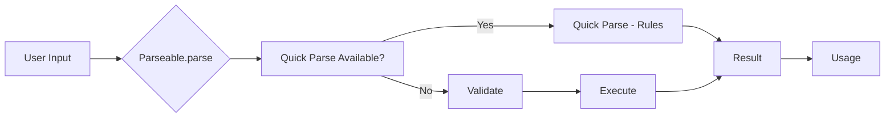
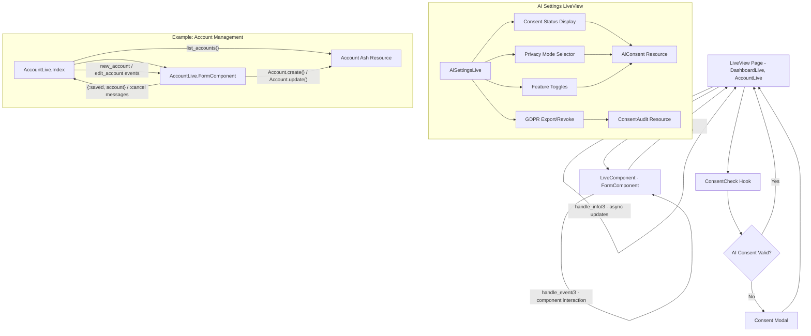
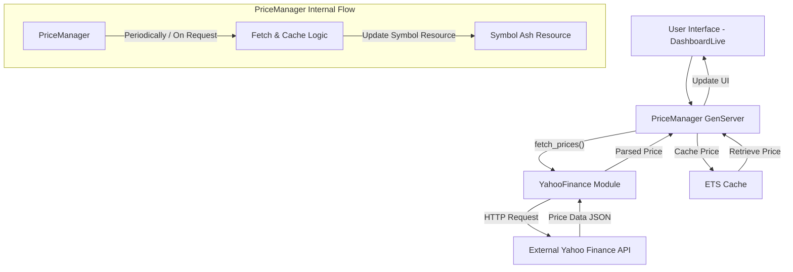
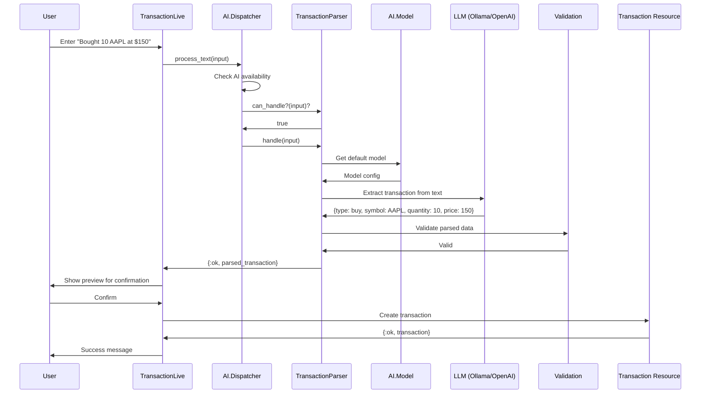
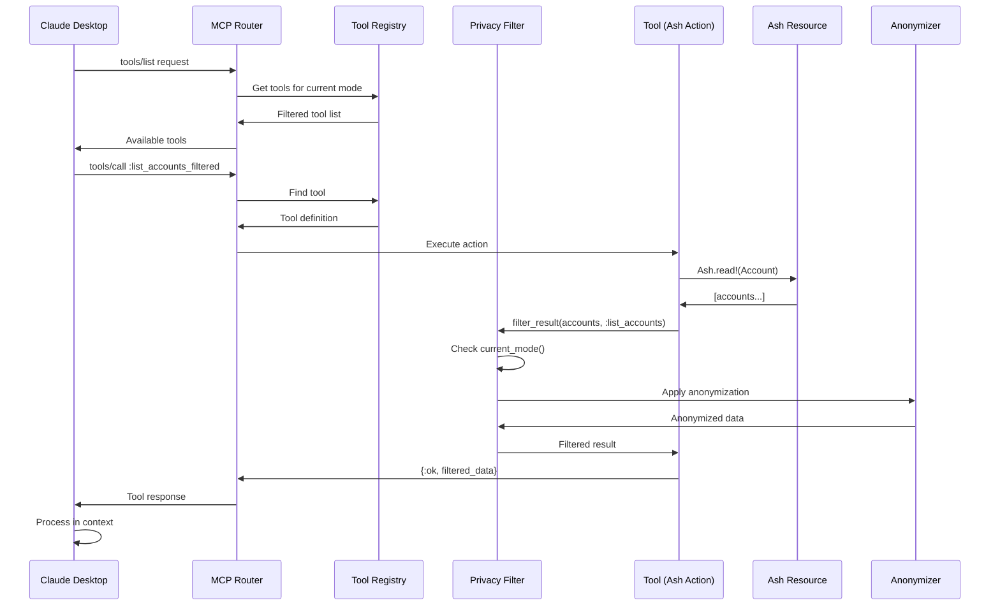
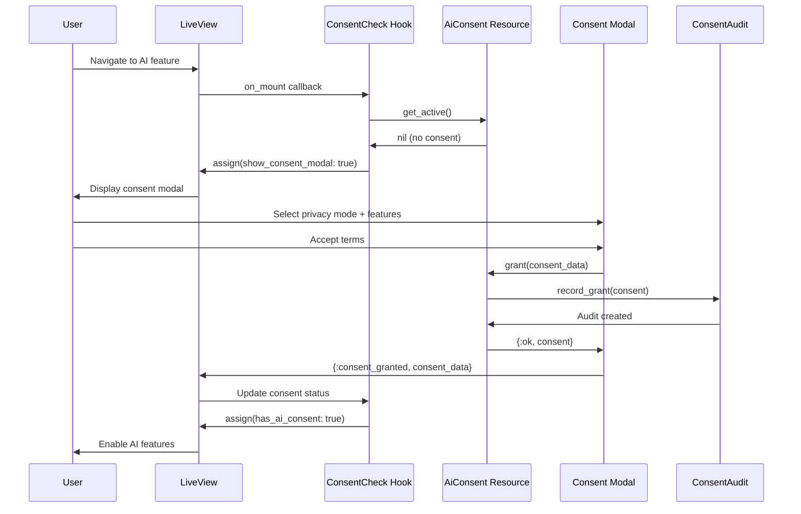

# Ashfolio Architecture Documentation

This document provides a detailed overview of Ashfolio's technical architecture, illustrating the relationships between its core components, modules, and data flows. Understanding this architecture is crucial for new developers to effectively contribute to the project.

This architecture is evolving through the Financial Management Expansion roadmap (see [ADR-002](../architecture/adr-002-financial-domain-expansion.md)). Current documentation reflects v0.10.0 with comprehensive financial management, AI integration, and MCP server capabilities.

## 1. Overall System Architecture

Ashfolio is built on the Phoenix LiveView framework, leveraging Elixir's OTP capabilities and the Ash Framework for robust data modeling and business logic. It follows a clear separation of concerns to ensure maintainability and extensibility.



## 2. Ash Resources and Relationships

The Ash Framework forms the backbone of Ashfolio's data model and business logic. Each resource encapsulates a core domain concept and defines its attributes, relationships, and available actions.



### Domain Organization

**Portfolio Domain** (`lib/ashfolio/portfolio.ex`)
- Resources: Account, Symbol, Transaction, TransactionCategory
- Purpose: Investment portfolio management, transactions, market data
- File: `lib/ashfolio/portfolio/`

**Financial Management Domain** (`lib/ashfolio/financial_management.ex`)
- Resources: Expense, FinancialGoal, FinancialProfile, NetWorthSnapshot
- Purpose: Cash management, expense tracking, retirement planning
- File: `lib/ashfolio/financial_management/`

**Legal Domain** (`lib/ashfolio/legal.ex`)
- Resources: AiConsent, ConsentAudit
- Purpose: AI consent management, GDPR compliance, audit trails
- File: `lib/ashfolio/legal/`

## 3. Legal Domain - AI Consent & Audit

The Legal domain manages user consent for AI features and maintains a GDPR-compliant audit trail.

### AiConsent Resource

**File:** `lib/ashfolio/legal/ai_consent.ex`

**Purpose:** Tracks user consent to AI features with versioning and privacy mode selection.

**Key Attributes:**
- `features` - Array of consented features (`:mcp_tools`, `:ai_analysis`, `:cloud_llm`)
- `privacy_mode` - Privacy level (`:strict`, `:anonymized`, `:standard`, `:full`)
- `terms_version` - Version identifier for accepted terms
- `terms_hash` - SHA256 hash for detecting terms changes
- `granted_at` / `withdrawn_at` - Consent lifecycle timestamps
- `ip_address` / `user_agent` - Audit metadata

**Actions:**
- `grant` - Initial consent with feature selection
- `update_privacy_mode` - Change privacy level
- `update_features` - Add/remove consented features
- `withdraw` - Revoke all consent
- `get_active` - Retrieve current active consent

**Calculations:**
- `active?` - Whether consent is currently valid
- `has_feature?` - Check if specific feature is consented

**Database-as-User Pattern:**
Uses singleton pattern - each SQLite database has one consent record representing the database owner's preferences.

### ConsentAudit Resource

**File:** `lib/ashfolio/legal/consent_audit.ex`

**Purpose:** Append-only audit trail for all consent-related actions.

**Key Attributes:**
- `action` - Type of action (`:granted`, `:withdrawn`, `:privacy_mode_changed`, etc.)
- `consent_id` - Reference to AiConsent record
- `previous_state` / `new_state` - Change tracking
- `metadata` - Additional context
- `recorded_at` - Immutable timestamp

**Actions Tracked:**
- Initial consent grant
- Consent withdrawal
- Privacy mode changes
- Feature toggle updates
- GDPR data export requests
- GDPR data deletion requests

**GDPR Compliance:**
- Append-only (no updates or deletes)
- Microsecond timestamp precision
- Complete audit trail for regulatory compliance

**Helper Functions:**
- `record_grant/2` - Log consent grant
- `record_withdrawal/2` - Log consent revocation
- `record_privacy_mode_change/4` - Log privacy changes
- `record_gdpr_export/1` - Log data export
- `for_consent/1` - Query audit trail for specific consent

## 4. AI Integration Layer

The AI layer provides multi-provider support for natural language processing with a privacy-first architecture.

### Architecture Overview



### AI.Dispatcher

**File:** `lib/ashfolio/ai/dispatcher.ex`

**Purpose:** Central routing for AI commands to appropriate handlers.

**Responsibilities:**
- Broadcast AI events via PubSub
- Find matching handler based on input
- Delegate processing to handler
- Check AI provider availability
- Handle errors gracefully

**Configuration:**
```elixir
config :ashfolio,
  ai_handlers: [
    Ashfolio.AI.Handlers.TransactionParser
  ]
```

### AI.Handler Behaviour

**File:** `lib/ashfolio/ai/handler.ex`

**Purpose:** Defines interface for AI command handlers.

**Callbacks:**
- `can_handle?/1` - Pattern matching for handler selection
- `handle/1` - Process the input and return result

### AI.Model - Multi-Provider Support

**File:** `lib/ashfolio/ai/model.ex`

**Purpose:** Abstraction over different AI providers.

**Supported Providers:**
- **Ollama** (`:ollama`) - Local AI, privacy-first default
  - No data leaves the machine
  - Requires local GPU/CPU resources
  - Models: llama3, mistral, etc.
- **OpenAI** (`:openai`) - Cloud AI, optional
  - Cloud-based processing
  - Requires API key
  - Models: gpt-4o-mini, gpt-4o, etc.

**Configuration:**
```elixir
config :ashfolio,
  ai_provider: :ollama,  # or :openai
  ollama_model: "llama3",
  openai_model: "gpt-4o-mini"
```

**Key Functions:**
- `default/0` - Get configured AI model
- `for_provider/1` - Get model for specific provider
- `available?/0` - Check if AI is configured

### AI.Handlers.TransactionParser

**File:** `lib/ashfolio/ai/handlers/transaction_parser.ex`

**Purpose:** Parses natural language transaction descriptions.

**Example Input:**
```
"Bought 10 shares of AAPL at $150 yesterday"
```

**Processing:**
1. Detect if input contains transaction keywords
2. Send to LLM with structured extraction prompt
3. Parse response into transaction attributes
4. Validate parsed data
5. Return structured result for user review

**Human-in-the-Loop:**
- Parsed transactions always require user confirmation
- User can edit before saving
- Errors show manual entry form

**Privacy Design:**
- Local AI (Ollama) default - no cloud transmission
- Cloud AI requires explicit consent via AiConsent
- Respects `cloud_llm` feature flag

## 5. MCP Server Infrastructure

The Model Context Protocol (MCP) server enables AI assistants to access portfolio data through standardized tools with privacy filtering.

### Architecture Overview



### MCP Router

**File:** `lib/ashfolio_web/mcp/router.ex` (provided by AshAi framework)

**Purpose:** JSON-RPC 2.0 endpoint for MCP protocol communication.

**Supported Methods:**
- `initialize` - Handshake and capability negotiation
- `tools/list` - Return available tools based on privacy mode
- `tools/call` - Execute a tool with privacy filtering

**Transport:** stdio (standard input/output)

**Integration:** Configured in Claude Desktop via `claude_desktop_config.json`

### Tool Registry (ModuleRegistry)

**File:** `lib/ashfolio_web/mcp/module_registry.ex`

**Purpose:** Central registry for tool discovery and lookup.

**Discovery Sources:**
1. **Ash Domains** - Tools defined via AshAi extension
2. **Parseable Modules** - Two-phase natural language tools
3. **Runtime** - Dynamically registered tools

**Key Functions:**
- `all_tools/0` - Get all registered tools
- `find_tool/1` - Lookup specific tool by name
- `tools_for_mode/1` - Filter tools by privacy mode
- `register_tool/2` - Runtime tool registration
- `refresh/0` - Force tool re-discovery

**Tool Definition:**
```elixir
%{
  name: :list_accounts_filtered,
  description: "List all investment and cash accounts",
  source: :ash_domain,
  domain: Ashfolio.Portfolio,
  action: :list_accounts_filtered,
  resource: AshfolioWeb.Mcp.Tools,
  privacy_modes: [:anonymized, :standard, :full]
}
```

### Privacy Filter

**File:** `lib/ashfolio_web/mcp/privacy_filter.ex`

**Purpose:** Filter tool responses based on configured privacy mode.

**Privacy Modes:**

**Strict Mode** (`:strict`)
- Returns: Aggregate counts, value tiers, percentages
- Hides: Names, exact amounts, individual records
- Example: "5 accounts, $100K-$500K range, 60% stocks"

**Anonymized Mode** (`:anonymized`) - Default
- Returns: Letter IDs (A, B, C), relative weights, asset classes
- Hides: Account names, exact dollar amounts
- Example: "Account A (45% of portfolio) holds US Large Cap"

**Standard Mode** (`:standard`)
- Returns: Account names, types, relative sizes
- Hides: Exact dollar amounts
- Example: "Fidelity 401k has large allocation"

**Full Access Mode** (`:full`)
- Returns: All data unfiltered
- Hides: Nothing
- Example: "Fidelity 401k $125,432.18 holds 500 shares VTSAX"

**Key Functions:**
- `current_mode/0` - Get active privacy mode
- `filter_result/3` - Apply privacy filtering to tool output
- `mode_allows?/2` - Check if mode permits tool usage

**Mode Configuration:**
```elixir
# Application config (default)
config :ashfolio, :mcp,
  privacy_mode: :anonymized

# Process dictionary (thread-safe test override)
Process.put(:mcp_privacy_mode, :strict)
```

### Anonymizer

**File:** `lib/ashfolio_web/mcp/anonymizer.ex`

**Purpose:** Transform sensitive data into anonymized representations.

**Transformations:**

**Account Names → Letter IDs:**
- "Fidelity 401k" → "Account A"
- "Schwab IRA" → "Account B"
- Deterministic (same account always gets same letter)

**Amounts → Weights:**
- $50,000 portfolio, $30,000 account → 0.60 weight
- All weights sum to 1.0

**Amounts → Tiers:**
- $45,000 → `:under_10k` | `:five_figures` | `:six_figures` | etc.

**Dates → Relative:**
- 2025-11-30 → "today", "yesterday", "2 weeks ago"

**Holdings → Asset Classes:**
- "AAPL" → "US Large Cap"
- "VXUS" → "International"

**Key Functions:**
- `letter_id/1` - Convert index to letter (0→A, 25→Z, 26→AA)
- `value_tier/1` - Classify amount into tier
- `anonymize_holdings/1` - Map symbols to asset classes
- `relative_date/1` - Convert date to relative description

### MCP Tools

**File:** `lib/ashfolio_web/mcp/tools.ex`

**Purpose:** Ash Resource defining available MCP tools as custom actions.

**Portfolio Query Tools:**

1. **list_accounts_filtered**
   - Returns all accounts with privacy filtering
   - Includes balances, types, holdings
   - Privacy mode affects detail level

2. **get_portfolio_summary**
   - Aggregate metrics and allocation
   - Diversification score, risk level
   - Total value (tier or exact based on mode)

3. **list_transactions_filtered**
   - Transaction history with filtering
   - Argument: `limit` (default: 100)
   - Returns type, symbol, amounts (filtered)

4. **list_symbols_filtered**
   - Available securities/symbols
   - Minimal privacy filtering (symbols are public data)

**Data Entry Tools (Two-Phase):**

5. **add_expense**
   - Phase 1 (Guidance): Returns expected schema
   - Phase 2 (Execution): Creates expense record
   - Supports natural language amounts/dates

6. **add_transaction**
   - Phase 1 (Guidance): Returns expected schema
   - Phase 2 (Execution): Creates transaction record
   - Supports natural language parsing

**Tool Discovery:**

7. **search_tools**
   - Search tools by keyword/description
   - Reduces token usage by ~85%
   - Returns matching tool definitions

**Implementation Pattern:**
```elixir
action :list_accounts_filtered, {:array, :map} do
  description("List all investment and cash accounts")

  run(fn _input, _context ->
    accounts = Ash.read!(Account)

    filtered =
      accounts
      |> Enum.map(&account_to_map/1)
      |> PrivacyFilter.filter_result(:list_accounts)

    {:ok, filtered}
  end)
end
```

### Tool Search

**File:** `lib/ashfolio_web/mcp/tool_search.ex`

**Purpose:** Optimize token usage via deferred tool loading.

**Pattern:** Anthropic's advanced MCP tool search pattern

**How It Works:**
1. AI first searches for relevant tools by keywords
2. Only matching tool definitions are loaded
3. AI selects specific tool to execute
4. Reduces context size by ~85% vs loading all tools

**Search Algorithm:**
- Keyword scoring (exact matches, partial matches)
- Description full-text search
- Category filtering
- Configurable result limits

**Key Functions:**
- `execute/1` - Search tools with query and limit
- `score_tool/2` - Calculate relevance score
- `tokenize/1` - Parse search query

## 6. Parsing Module

The Parsing module provides a standardized interface for parsing user input with optional LLM assistance.

### Architecture



### Parseable Behaviour

**File:** `lib/ashfolio/parsing/parseable.ex`

**Purpose:** Define standard interface for parsing modules.

**Required Callbacks:**
- `name/0` - Tool identifier (snake_case)
- `description/0` - Human-readable description
- `input_schema/0` - JSON Schema for input validation
- `validate/1` - Validate input, return `:ok` or `{:error, reason}`
- `execute/1` - Execute parsing, return `{:ok, result}` or `{:error, reason}`

**Optional Callbacks:**
- `can_quick_parse?/1` - Check if quick parse path available
- `quick_parse/1` - Fast rule-based parsing

**Unified Interface:**
```elixir
Parseable.parse(AmountParser, "$100")
# Automatically selects quick_parse or validate+execute
```

**Implementation Example:**
```elixir
defmodule MyParser do
  @behaviour Ashfolio.Parsing.Parseable

  def name, do: "my_parser"
  def description, do: "Parses my format"

  def input_schema do
    %{type: "object", properties: %{...}}
  end

  def validate(input), do: :ok
  def execute(input), do: {:ok, result}

  # Optional quick path
  def can_quick_parse?(input), do: simple?(input)
  def quick_parse(input), do: {:ok, fast_result}
end
```

### AmountParser

**File:** `lib/ashfolio/parsing/amount_parser.ex`

**Purpose:** Parse monetary amounts from various formats.

**Supported Formats:**
- Basic: `"100"`, `"100.50"`
- With symbols: `"$100"`, `"€50.00"`
- Abbreviated: `"1.5k"`, `"2.3M"`, `"1B"`
- Currency prefix: `"USD 100"`, `"EUR 500"`
- Ranges: `"$50-100"` (returns midpoint)

**Key Functions:**
- `parse/1` - Main parsing function
- `clean_amount/1` - Remove symbols and normalize
- `parse_abbreviation/1` - Handle k/M/B suffixes

**Returns:** `Decimal` type for precision

### Schema Helpers

**File:** `lib/ashfolio/parsing/schema.ex`

**Purpose:** Generate JSON schemas for LLM-assisted structuring.

**Key Functions:**
- `for_expense/0` - Expense record schema
- `for_transaction/0` - Transaction record schema
- `format_as_guidance/1` - Convert schema to LLM prompt

**Usage in Two-Phase Tools:**
1. Phase 1: Return schema as guidance
2. LLM structures user input according to schema
3. Phase 2: Validate and execute structured input

## 7. LiveView Component Flow

Phoenix LiveView handles the dynamic user interface, providing real-time updates and interactive components. The application uses a component-based approach for UI modularity.



### ConsentCheck Hook

**File:** `lib/ashfolio_web/hooks/consent_check.ex`

**Purpose:** LiveView hook to enforce AI consent requirements.

**Functionality:**
- Checks for active AI consent on mount
- Blocks AI features if consent not granted
- Shows consent modal when needed
- Updates assigns with consent status

**Integration:**
```elixir
def mount(_params, _session, socket) do
  socket = ConsentCheck.on_mount(socket)
  # socket now has :has_ai_consent, :ai_privacy_mode, etc.
end
```

### Consent Modal Component

**File:** `lib/ashfolio_web/components/consent_modal.ex`

**Purpose:** Interactive consent granting interface.

**Features:**
- Privacy mode selection (4 options)
- Feature toggles (MCP Tools, AI Analysis, Cloud AI)
- Terms display with versioning
- Acceptance checkbox
- Grant/decline actions

**Events:**
- `{:consent_granted, consent_data}` - Sent to parent on grant
- `:consent_declined` - Sent to parent on decline

## 8. Market Data Flow

The market data system is responsible for fetching, caching, and providing current prices for symbols. It's designed for resilience and efficiency.



## 9. Data Flow Diagrams

### AI Natural Language Entry Flow



### MCP Tool Execution Flow



### Consent Check Flow



## 10. File Structure

### Core Application Structure

```
lib/
├── ashfolio/                          # Business Logic
│   ├── portfolio.ex                   # Portfolio Domain
│   ├── portfolio/                     # Portfolio Resources
│   │   ├── account.ex
│   │   ├── symbol.ex
│   │   ├── transaction.ex
│   │   └── transaction_category.ex
│   │
│   ├── financial_management.ex        # Financial Domain
│   ├── financial_management/          # Financial Resources
│   │   ├── expense.ex
│   │   ├── financial_goal.ex
│   │   ├── financial_profile.ex
│   │   └── net_worth_snapshot.ex
│   │
│   ├── legal.ex                       # Legal Domain (v0.10.0)
│   ├── legal/                         # Legal Resources
│   │   ├── ai_consent.ex              # Consent management
│   │   └── consent_audit.ex           # Audit trail
│   │
│   ├── ai/                            # AI Integration (v0.8.0)
│   │   ├── dispatcher.ex              # Central AI router
│   │   ├── handler.ex                 # Handler behaviour
│   │   ├── model.ex                   # Multi-provider config
│   │   └── handlers/
│   │       └── transaction_parser.ex  # Natural language parsing
│   │
│   ├── parsing/                       # Parsing Module (v0.10.0)
│   │   ├── parseable.ex               # Behaviour definition
│   │   ├── amount_parser.ex           # Amount parsing
│   │   └── schema.ex                  # LLM schema helpers
│   │
│   ├── calculators/                   # Financial Calculations
│   │   ├── net_worth_calculator.ex
│   │   ├── retirement_calculator.ex
│   │   ├── tax_calculator.ex
│   │   └── portfolio_optimizer.ex
│   │
│   ├── market_data/                   # Market Data Services
│   │   ├── price_manager.ex
│   │   └── yahoo_finance.ex
│   │
│   └── repo.ex                        # SQLite Repository

lib/ashfolio_web/                      # Web Layer
├── mcp/                               # MCP Server (v0.9.0-v0.10.0)
│   ├── tools.ex                       # MCP tool definitions
│   ├── privacy_filter.ex              # Privacy mode filtering
│   ├── anonymizer.ex                  # Data anonymization
│   ├── module_registry.ex             # Tool discovery
│   ├── parser_tool_executor.ex        # Two-phase tool execution
│   └── tool_search.ex                 # Tool search optimization
│
├── live/                              # LiveView Pages
│   ├── dashboard_live.ex
│   ├── account_live/
│   ├── transaction_live/
│   ├── expense_live/
│   └── settings/
│       └── ai_settings_live.ex        # AI consent UI (v0.10.0)
│
├── components/                        # Reusable Components
│   ├── core_components.ex
│   ├── consent_modal.ex               # AI consent modal (v0.10.0)
│   └── category_tag.ex
│
├── hooks/                             # LiveView Hooks
│   └── consent_check.ex               # AI consent enforcement (v0.10.0)
│
├── router.ex                          # Route definitions
└── endpoint.ex                        # Phoenix endpoint
```

### Configuration Files

```
config/
├── config.exs                         # Base configuration
├── dev.exs                            # Development settings
├── prod.exs                           # Production settings
└── test.exs                           # Test settings

# AI Configuration Example (config.exs)
config :ashfolio,
  ai_provider: :ollama,                # or :openai
  ollama_model: "llama3",
  openai_model: "gpt-4o-mini",
  ai_handlers: [
    Ashfolio.AI.Handlers.TransactionParser
  ]

# MCP Configuration Example (config.exs)
config :ashfolio, :mcp,
  privacy_mode: :anonymized,           # :strict | :anonymized | :standard | :full
  enabled: true
```

### Database Migrations

```
priv/repo/migrations/
├── 20250901_create_accounts.exs
├── 20250901_create_symbols.exs
├── 20250901_create_transactions.exs
├── 20250902_create_transaction_categories.exs
├── 20250905_create_expenses.exs
├── 20250906_create_financial_goals.exs
├── 20250907_create_financial_profiles.exs
├── 20251130_create_ai_consents.exs         # v0.10.0
└── 20251130_create_consent_audits.exs      # v0.10.0
```

## 11. Key Architectural Patterns

### Database-as-User Architecture

Ashfolio uses a unique "database-as-user" pattern where each SQLite database file represents a single user. This eliminates the need for user authentication and multi-tenancy complexity.

**Benefits:**
- No user_id foreign keys needed
- Simpler queries (no WHERE user_id clauses)
- True local-first architecture
- GDPR compliance simplified (just delete the database file)
- Better performance (no multi-tenant indexing)

**Implementation:**
- UserSettings resource uses singleton pattern
- AiConsent resource uses singleton pattern
- Each resource assumes single-user context

### Privacy-First AI Integration

AI features are designed with privacy as the default:

**Local-First:**
- Ollama (local AI) is default provider
- Data never leaves machine by default
- Cloud AI requires explicit consent

**Granular Consent:**
- Feature-level toggles (MCP, Analysis, Cloud)
- Privacy mode selection (4 levels)
- Revocable at any time

**Privacy Filtering:**
- All MCP tools filtered by privacy mode
- Anonymization at data layer
- No sensitive data in tool responses unless explicitly allowed

### Event-Driven Updates

Real-time updates via Phoenix PubSub:

**Topics:**
- `portfolio:updates` - Account/transaction changes
- `financial:updates` - Expense/goal changes
- `ai:commands` - AI processing events
- `consent:updates` - Consent changes

**Pattern:**
```elixir
# Broadcast change
Phoenix.PubSub.broadcast(
  Ashfolio.PubSub,
  "portfolio:updates",
  {:account_updated, account}
)

# Subscribe in LiveView
Phoenix.PubSub.subscribe(Ashfolio.PubSub, "portfolio:updates")

# Handle in LiveView
def handle_info({:account_updated, account}, socket) do
  {:noreply, update_account(socket, account)}
end
```

### Two-Phase Parsing Pattern

Natural language tools use a two-phase approach:

**Phase 1 - Guidance:**
- User provides text: "Add expense: groceries $87.43"
- Tool returns expected schema
- LLM structures the input

**Phase 2 - Execution:**
- User (via LLM) provides structured data
- Tool validates schema compliance
- Tool executes action (create record)

**Benefits:**
- Clear separation of parsing and execution
- Human-in-the-loop validation
- Graceful fallback to manual entry

### Ash Framework Integration

Ash provides the foundation for business logic:

**Resources as Single Source of Truth:**
- Define schema, validations, actions in one place
- Automatic GraphQL/JSON:API generation (if needed)
- Built-in authorization (can be added later)

**Actions Over Controllers:**
- `Account.create/1` instead of controller CRUD
- Domain logic stays in domain layer
- LiveViews call actions directly

**Calculations and Aggregations:**
- `active?` calculation on AiConsent
- Portfolio metrics as calculations
- Efficient database queries

## 12. Testing Architecture

### Test Organization

Tests follow the Testing Strategy (see `docs/TESTING_STRATEGY.md`):

**Tags:**
- `@tag :unit` - Fast unit tests (<50ms each)
- `@tag :integration` - Integration tests with database
- `@tag :live` - LiveView tests (5-15s each)
- `@tag :performance` - Performance benchmarks (30-60s)

**Structure:**
```
test/
├── ashfolio/                          # Domain tests
│   ├── portfolio/
│   ├── financial_management/
│   ├── legal/                         # Consent tests
│   ├── ai/                            # AI integration tests
│   └── parsing/                       # Parser tests
│
├── ashfolio_web/                      # Web layer tests
│   ├── mcp/                           # MCP server tests
│   ├── live/                          # LiveView tests
│   └── components/                    # Component tests
│
└── support/                           # Test helpers
    ├── fixtures.ex
    └── data_case.ex
```

### Test Coverage Requirements

- **Financial Calculators:** 100% branch coverage
- **Legal/Consent:** 100% coverage (GDPR compliance)
- **MCP Tools:** Full integration testing
- **AI Handlers:** Mock LLM responses for deterministic tests

## Version History

- **v0.1.0** (Initial Release) - Portfolio management foundation
- **v0.5.0** (September 2025) - Financial Management expansion, Money Ratios
- **v0.6.0** (September 2025) - Corporate Actions engine
- **v0.7.0** (September 2025) - Advanced Portfolio Analytics, Efficient Frontier
- **v0.8.0** (November 2025) - AI Natural Language Entry, Multi-Provider AI
- **v0.9.0** (November 2025) - MCP Integration, Privacy Filtering
- **v0.10.0** (November 2025) - AI Consent Management, Parsing Module, Tool Discovery

---

**Last Updated:** 2025-12-13

**Architecture Version:** v0.10.0

This architecture documentation reflects the current state of Ashfolio as a comprehensive financial management platform with privacy-first AI integration and MCP server capabilities. As the system evolves, this document will be updated to reflect new domains, patterns, and architectural decisions.

For specific architectural decisions, see the `docs/architecture/` directory for ADRs (Architecture Decision Records).
