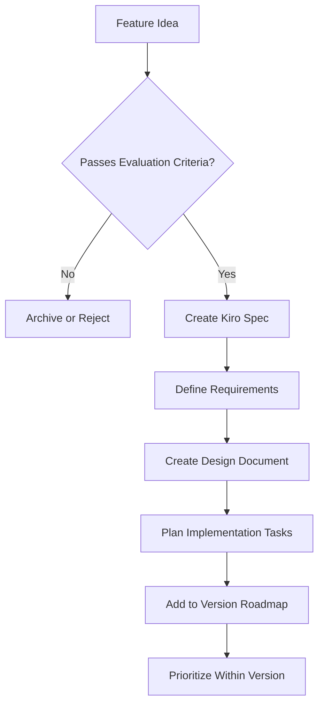

# Ashfolio Roadmap Documentation

This directory contains Ashfolio's strategic planning and architectural decision documentation.

## 📋 Current Documents

### 🗺️ [v0.2-v0.5 Roadmap](v0.2-v0.5-roadmap.md)

**Active roadmap** for near-term feature development, organized by version with clear priorities and architectural alignment.

### 🏗️ [Architectural Decision Record](../architecture/adr-001-local-first-architecture.md)

**Professional ADR** documenting our commitment to local-first, single-user SQLite architecture with complete rationale, alternatives considered, and consequences.

## 📚 Archive

### [Ghostfolio-Inspired Comprehensive Features](../archive/ghostfolio-inspired-comprehensive-features.md)

Complete feature list inspired by the Ghostfolio project. **Not a development roadmap** - serves as long-term inspiration while understanding most features require architectural changes incompatible with our local-first approach.

## 📐 Roadmap Development Process

### Feature Evaluation Framework

Before any feature enters the roadmap, it must pass these criteria:

1. ** Architectural Alignment**

   - Works with SQLite local-first design
   - No external service dependencies
   - Compatible with single-user model
   - Maintains privacy and offline capability

2. **📊 User Value Assessment**

   - Significantly improves portfolio management workflow
   - Addresses real user pain points
   - Provides measurable benefit over manual alternatives

3. **🔧 Technical Feasibility**

   - Implementable with current Phoenix/Ash/SQLite stack
   - Reasonable complexity for maintenance
   - Can be thoroughly tested
   - Follows "boring and obvious" implementation philosophy

4. **🎯 Project Scope Alignment**
   - Fits incremental development approach
   - Doesn't compromise core architecture decisions
   - Maintains focus on personal portfolio management

### Roadmap Planning Workflow

### Version Planning Strategy

- 3-5 new features every 2-3 months
- Bug fixes and small improvements as needed
- Prioritized by user value and implementation complexity
- Every feature must align with local-first SQLite approach

### Documentation Standards

**For Each Roadmap Feature:**

- Clear description of user benefit
- How it integrates with existing architecture
- Low/Medium/High estimate
- What must be completed first
- How we know it's working correctly

**For Architectural Changes:**

- Document rationale and trade-offs
- How existing users are affected
- Impact on existing features
- How difficult to undo if problems arise

## 🎯 Current Focus: v0.4.0

**Financial Planning & Advanced Analytics**

Ready for development following successful v0.3.X completion (90% delivered):

1. **Retirement Planning Tools** - 25x expenses rule, 4% withdrawal calculations
2. **Financial Goal Setting** - Emergency fund, retirement, custom savings goals  
3. **Long-term Forecasting** - Growth projections with configurable assumptions
4. **Advanced Portfolio Analytics** - TWR, MWR, benchmark comparisons, rolling returns

**Target**: Q1 2026 (8-10 weeks)

> **Recent Achievement**: v0.3.X series delivered comprehensive financial analytics platform with expense tracking, net worth snapshots, CSV import, automated background jobs, and professional charting - transforming Ashfolio from basic portfolio tracking into a complete financial analytics solution.

## 🔮 Long-Term Vision

While maintaining our focused local-first approach, we acknowledge that some portfolio management features may require architectural evolution. The comprehensive features archive serves as inspiration for potential future directions while clearly documenting why most features are incompatible with our current architectural commitments.

Incremental improvement while preserving simplicity, privacy, and local-first architecture through v1.0 and beyond.

## 📞 Contributing to Roadmap

**Have a feature suggestion?**

1. Check if it aligns with our [Architectural Decisions](architectural-decisions.md)
2. Review existing [.kiro specs](.kiro/specs/) to avoid duplication
3. Open an issue with feature proposal including user story and technical approach
4. Participate in roadmap planning discussions

**Questions about roadmap priorities?**

- Review version roadmap for current priorities
- Check architectural decisions for context on excluded features
- Open discussion about feature prioritization or timeline questions
